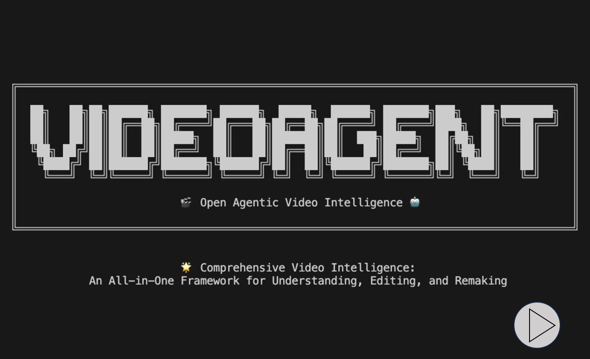
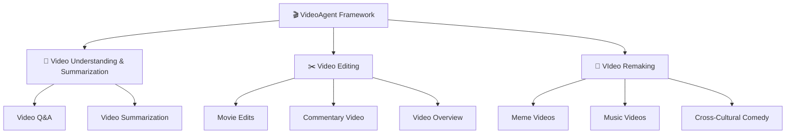

<div align="center">


<!-- # Open Agentic Video Intelligence -->
<br>

**🌟 Comprehensive Video Intelligence: An All-in-One Framework for Understanding, Editing, and Remaking**

<div align="center">

</div>

<a href='https://space.bilibili.com/3546868449544308'></a>&nbsp;
<a href='https://www.youtube.com/@AI-Creator-is-here'></a>&nbsp;

</div>

<div align="center">
	
[English](readme.md) | [简体中文](readme_zh.md)

</div>

---

## 📹 **Demo Video**
<div>
<a href="https://www.youtube.com/watch?v=JZkXO1NG2Ok" target='_blank'></a>
</div>

In this video, we demonstrate how to use VideoAgent to:
- Clearly articulate user requirements
- Achieve ​intent analysis and ​autonomous tool use & planning
- Create ​multi-modal products, including detailed workflows
- Fully automatic generation of video overview

## 🚀 Key Features

🧠 - **Understanding Video Content**<br>
Enable in-depth analysis, summarization, and insight extraction from video media with advanced multi-modal intelligence capabilities.

✂️ - **Editing Video Clips**<br>
Provide intuitive tools for assembling, clipping, and reconfiguring content with seamless workflow integration.

🎨 - **Remaking Creative Videos**<br>
Utilize generative technologies to produce new, imaginative video content through AI-powered creative assistance.

🔧 - **Multi-Modal Agentic Framework**<br>
Deliver comprehensive video intelligence through an integrated framework that combines multiple AI modalities for enhanced performance.

🚀 - **Seamless Natural Language Experience**<br>
Transform video interaction and creation through pure conversational AI - no complex interfaces or technical expertise required, just natural dialogue with VideoAgent.

 


</div>

---

## 📑 Table of Contents

- [🌟 System Overview](#system-overview)
- [🔧 Evaluation](#evaluation)
- [🚀 Quick Start](#quick-start)
- [🔮 Demos](#demos)
- [💖 Acknowledgments](#acknowledgments)


### 🔥 **Why VideoAgent?**

| 🧠 **Easy-to-Use** | 🚀 **Boundless Creativity** | 🎨 **High-Quality** |
|:---:|:---:|:---:|
| One-Prompt Video Creation | Create From Any Ideas | Human-Quality Video Production |
| Transform your ideas into professional videos | Workflow generation for your unique ideas | Deliver videos that meet professional standards |

---

## 🌟System Overview

Our system introduces three key innovations for automated video processing. **Intent Analysis** captures both explicit and implicit sub-intents beyond user commands. **Autonamous Tool Use & Planning** employs graph-powered workflow generation with adaptive feedback loops for automated agent orchestration. **Multi-Modal Understanding** transforms raw input into semantically aligned visual queries for enhanced retrieval.

### 🧠 **Intent Analysis**
	
- 🔍 VideoAgent intelligently **decomposes user instructions** into both **explicit and implicit sub-intents**, capturing nuanced requirements that users may not explicitly state. This advanced parsing ensures **comprehensive understanding** of user goals beyond surface-level commands.

- 🎯 Through an **intent-to-agent mapping mechanism**, the system identifies precisely which capabilities within the multi-agent framework are needed. This targeted approach enables **efficient activation** of relevant system components while avoiding unnecessary computational overhead for **optimal task execution**.

### 🔧 **Autonomous Tool Use & Planning**

- ⚙️ **A graph-powered framework** automatically translates user intents into **executable workflows**. The system dynamically selects appropriate agents and constructs optimal execution sequences. Nodes represent tool capabilities while edges define workflow connections for complex video tasks.

- 🔄 Adaptive feedback loops continuously refine the planning process through **two-step self-evaluation**. This ensures robust **automated decision-making** and seamless execution. The system **self-corrects** and optimizes performance throughout the entire task lifecycle.

### 🎬 **Multi-Modal Understanding**

- 📋 **The Storyboard Agent** transforms raw user input into **optimized visual queries**. It first analyzes pre-captioned video material banks to understand available resources. This foundational analysis ensures the system knows exactly what content is accessible for query processing.

- 💡 The agent then **decomposes user input** into **fine-grained sub-queries** that are both visually and semantically aligned. This sophisticated breakdown enables **enhanced video retrieval** by matching user intentions with the most relevant visual content in the database.

---

## 🔧Evaluation
We conduct extensive experiments across multiple dimensions to validate the effectiveness of VideoAgent in addressing key challenges.

### Boundless Creativity via Workflow Construction

To evaluate VideoAgent's **boundless creativity** through automatic workflow construction, we compared five broadly applicable agents across three backbone models. Our findings demonstrate that VideoAgent significantly outperforms other baselines on the Audio and Video datasets, showcasing its **creative workflow generation capabilities** through graph-structured guidance and self-reflection driven by dedicated self-evaluation feedback. Furthermore, we observe that VideoAgent exhibits superior and more stable **creative performance** under the Claude 3.7 backbone compared to GPT-4o and Deepseek-v3, while other baseline methods show fluctuations across different backbones. This highlights VideoAgent's ability to **unleash boundless creativity** by automatically constructing diverse and effective workflows that adapt to various user requirements, with more capable LLMs achieving deeper comprehension and providing more robust creative solutions for complex graph-based tasks.

<div align="center">
    <br>
    <br>
</div>

### Superior Multimodal Understanding

To validate our multimodal understanding capabilities, we conducted text-to-video retrieval experiments using shuffled caption queries. The evaluation employs three metrics to assess our model's ability to retrieve corresponding visual content: Recall measures the model's ability to correctly reorder shuffled video clips by comparing retrieved clip midpoints against ground truth positions; Embedding Matching-based score assesses coarse-grained alignment between generated videos and high-level caption summaries; and Intersection over Union quantifies temporal alignment accuracy at the clip level by computing the ratio of temporal overlap to total coverage between retrieved and ground truth intervals. The experimental results demonstrate that our approach can retrieve more accurate video segments, thereby showcasing our precise multimodal understanding capabilities.


<div align="center">
    <br>
</div>


### More Iterations, Better Performance

We investigate VideoAgent's iterative refinement capabilities by analyzing the impact of reflection rounds on performance. Through comprehensive hyperparameter experiments on workflow composition across two datasets using three LLM backbones, we demonstrate VideoAgent's **notable self-improvement ability**. The results reveal that while early iterations produce baseline results, our system's **adaptive reflection mechanism** drives significant performance gains with each subsequent round. VideoAgent achieves **consistent workflow composition success rates of 0.95** across all tested configurations, showcasing its **robust self-correction capabilities** and **reliable high-quality output** regardless of the underlying LLM backbone.
<div align="center">
    <div style="display: flex; justify-content: center; width: 80%; flex-wrap: nowrap;">
        
	
    </div>
</div>

---

## 🚀Quick Start

### 🖥️ **Environment**

```
GPU Memory: 8GB  
OS: Linux, Windows
```

### 📥 **Clone and Install**

```bash
git clone https://github.com/HKUDS/VideoAgent.git
conda create --name videoagent python=3.10
conda activate videoagent
conda install -y -c conda-forge pynini==2.1.5 ffmpeg
pip install -r requirements.txt
```

### 📦 **Model Download**

```bash
# Download CosyVoice
cd tools/CosyVoice
huggingface-cli download PillowTa1k/CosyVoice --local-dir pretrained_models
```

```bash
# Download fish-speech
cd tools/fish-speech
huggingface-cli download fishaudio/fish-speech-1.5 --local-dir checkpoints/fish-speech-1.5
```

```bash
# Download seed-vc
cd tools/seed-vc
huggingface-cli download PillowTa1k/seed-vc --local-dir checkpoints
```

```bash
# Download DiffSinger
cd tools/DiffSinger
huggingface-cli download PillowTa1k/DiffSinger --local-dir checkpoints
```

```bash
# Download Whisper
cd tools
huggingface-cli download openai/whisper-large-v3-turbo --local-dir whisper-large-v3-turbo
```

```bash
# Make sure git-lfs is installed (https://git-lfs.com)
git lfs install
```

```bash
# Download ImageBind
cd tools
mkdir .checkpoints
cd .checkpoints
wget https://dl.fbaipublicfiles.com/imagebind/imagebind_huge.pth
```

**🌟 Multiple models are available for your convenience; you may wish to download only those relevant to your project.**


<table>
  <tr>
    <th align="center">Feature Type</th>
    <th align="center">Video Demo</th>
    <th align="center">Required Models</th>
  </tr>
  <tr>
    <td align="center">Cross Talk</td>
    <td align="center">English Stand-up Comedy to Chinese Crosstalk</td>
    <td align="center">CosyVoice, Whisper, ImageBind</td>
  </tr>
  <tr>
    <td align="center">Talk Show</td>
    <td align="center">Chinese Crosstalk to English Stand-up Comedy</td>
    <td align="center">CosyVoice, Whisper, ImageBind</td>
  </tr>
  <tr>
    <td align="center">MAD TTS</td>
    <td align="center">Xiao-Ming-Jian-Mo(小明剑魔) Meme</td>
    <td align="center">fish-speech</td>
  </tr>
  <tr>
    <td align="center">MAD SVC</td>
    <td align="center">AI Music Videos</td>
    <td align="center">DiffSinger, seed-vc, Whisper, ImageBind</td>
  </tr>
  <tr>
    <td align="center">Rhythm</td>
    <td align="center">Spider-Man: Across the Spider-Verse</td>
    <td align="center">Whisper, ImageBind</td>
  </tr>
  <tr>
    <td align="center">Comm</td>
    <td align="center">Commentary Video</td>  
    <td align="center">CosyVoice, Whisper, ImageBind</td>
  </tr>
  <tr>
    <td align="center">News</td>
    <td align="center">Tech News: OpenAI's GPT-4o Image Generation Release</td>
    <td align="center">CosyVoice, Whisper, ImageBind</td>
  </tr>
  <tr>
    <td align="center">Video QA/Summarization</td>
    <td align="center">Dune 2 Movie Cast Update Podcast</td>
    <td align="center">Whisper</td>
  </tr>
</table>

</div>

### 🤖 **LLM Configuration**

```bash
# VideoAgent\environment\config\config.yml
# Applicable scenarios and LLM configuration
# Claude is required as it powers the Agentic Graph Router 
llm:
  # Video Remixing/TTS/SVC/Stand-up/CrossTalk
  deepseek_api_key: ""  
  deepseek_base_url: ""  

  # Agentic Graph Router/TTS/SVC/Stand-up/CrossTalk
  claude_api_key: ""  
  claude_base_url: ""

  # Video Editing/Overview/Summarization/QA/Commentary Video
  gpt_api_key: ""  
  gpt_base_url: ""  

  # MLLM for caption and fine-grained video understanding
  gemini_api_key: ""  
  gemini_base_url: ""  
```

### 🎯 **Usage**

```bash
# With the configuration now complete, proceed to run the following instructions:
python main.py
# The console will output:
User Requirement: ...
# Requirement Example:
# 1. I need to create a reworded version of an existing video where the speech content is modified while maintaining the original speaker's voice. The video should have the same visuals as the original, but with updated dialogue that follows my specific requirements.
# 2. I have a standup comedy script that I'd like to turn into a professional-looking video. I need the script to be performed with good comedic timing and audience reactions, then matched with relevant video footage to create a complete standup comedy special. I already have a reference script and some footage I want to use for the video.
```
The current LLM selections are optimized for each function.

You can also adjust the model names in `VideoAgent\environment\config\llm.py` if needed.

---

## 🔮Demos

<table>
<tr>
<td align="center" width="33%">
<a href="https://www.bilibili.com/video/BV1C9Z6Y3ESo/" target='_blank'></a>
Movie Edits
</td>
<td align="center" width="33%">
<a href="https://www.bilibili.com/video/BV1ucZ6YmEBU/" target='_blank'></a>
Meme Videos
</td>
<td align="center" width="33%">
<a href="https://www.bilibili.com/video/BV1t8ZCYsEeA/" target='_blank'></a>
Music Videos
</td>
</tr>
<tr>
<td align="center" width="33%">
<a href="https://www.bilibili.com/video/BV1ucZ6YmESg/" target='_blank'></a>
Verbal Comedy Arts
</td>
<td align="center" width="33%">
<a href="https://www.bilibili.com/video/BV1TmZ6YjEvV/" target='_blank'></a>
Commentary Video
</td>
<td align="center" width="33%">
<a href="https://www.bilibili.com/video/BV12mZ6YLEqW/" target='_blank'></a>
Video Overview
</td>
</tr>
</table>

For additional demo usage details, please refer to:  
👉 [Demos Documentation](demos_documents.md)


You can find more fun videos on our Bilibili channel here:  
👉 [Bilibili Homepage](https://space.bilibili.com/3546868449544308)  
Feel free to check it out for more entertaining content! 😊


**Note**: All videos are used for research and demonstration purposes only. The audio and visual assets are sourced from the Internet. Please contact us if you believe any content infringes upon your intellectual property rights.

---

## 💖**Acknowledgments**

We express our deepest gratitude to the numerous individuals and organizations that have made VideoAgent possible. This framework stands on the shoulders of giants, benefiting from the collective wisdom of the open-source community and the groundbreaking work of researchers worldwide.

### 🔧 **Open-Source Community and Service Providers**

- [CosyVoice](https://github.com/FunAudioLLM/CosyVoice)
- [Fish Speech](https://github.com/fishaudio/fish-speech)
- [Seed-VC](https://github.com/Plachtaa/seed-vc)
- [DiffSinger](https://github.com/MoonInTheRiver/DiffSinger)
- [VideoRAG](https://github.com/HKUDS/VideoRAG)
- [ImageBind](https://github.com/facebookresearch/ImageBind)
- [Whisper](https://github.com/openai/whisper)
- [Librosa](https://github.com/librosa/librosa)


### 🎨 **Content Creators and Inspiration**

Our work has been significantly enriched by the creative contributions of content creators across various platforms. We acknowledge:

- 🎬 **Content Creators**: The talented creators behind the original video content used for testing and demonstration
- 🎭 **Comedy Artists**: Those whose work inspired our cross-cultural adaptations  
- 🎥 **Filmmakers**: The production teams behind the movies and TV shows featured in our demos

**⚠️ Note**: All content used in our demonstrations is for research purposes only. We deeply respect the intellectual property rights of all content creators and welcome any concerns or feedback regarding content usage.

---

<div align="center">

</div>


---------------------------


Giới thiệu Dự án VideoAgent
1. VideoAgent là gì?
VideoAgent là một framework mã nguồn mở giúp bạn tự động hiểu nội dung video, chỉnh sửa video, và sáng tạo lại video bằng công nghệ trí tuệ nhân tạo đa phương thức (AI đa modal).
Bạn có thể tương tác với hệ thống chỉ bằng ngôn ngữ tự nhiên, không cần kỹ thuật phức tạp, dễ dùng cho cả người mới.

2. VideoAgent làm được gì?
Các tính năng chính:
Hiểu video:
Phân tích, tóm tắt, trích xuất ý chính từ nội dung video (ví dụ: trả lời câu hỏi về video, tóm tắt nội dung video, v.v.).

Chỉnh sửa video:
Cắt ghép, lắp ráp, làm lại các đoạn video theo yêu cầu chỉ bằng cách nhập mô tả ý tưởng.

Sáng tạo lại video:
Tạo ra video mới, nội dung sáng tạo dựa trên AI như video meme, video âm nhạc, chế lại kịch bản, v.v.

Trải nghiệm hội thoại tự nhiên:
Chỉ cần mô tả ý tưởng hoặc yêu cầu bằng tiếng Anh/Tiếng Trung (hoặc ngôn ngữ đã hỗ trợ), hệ thống sẽ tự động hiểu và thực hiện.

Một số ứng dụng nổi bật:
Chuyển đổi kịch bản hài Anh - Trung và ngược lại

Biến video standup comedy thành meme

Tạo video âm nhạc AI

Tạo video bình luận, bản tin, podcast tóm tắt phim, v.v.

3. Cách hoạt động của VideoAgent
VideoAgent dùng các mô hình AI mạnh mẽ như Claude, GPT, DeepSeek, Gemini… để:

Phân tích ý định:
Tự động bóc tách ý định của bạn (dù diễn đạt trực tiếp hay gián tiếp), sau đó xác định công cụ, workflow phù hợp.

Tự lên kế hoạch workflow:
Dựa vào biểu đồ tác vụ (graph workflow), chọn agent (tác nhân) thích hợp cho từng bước, tự phản hồi & tối ưu quá trình.

Hiểu nội dung đa phương thức:
Kết hợp phân tích cả hình ảnh, âm thanh, văn bản… Đặc biệt có “Storyboard Agent” giúp phân tích tài nguyên video có sẵn và chia nhỏ yêu cầu thành các truy vấn phù hợp.

4. Dành cho ai?
Bạn muốn tự động hóa quy trình xử lý video (hiểu – chỉnh sửa – sáng tạo lại) mà không cần kỹ năng code phức tạp.

Tạo nội dung sáng tạo, biến ý tưởng thành video chuyên nghiệp chỉ qua hội thoại.

Phù hợp cho cả người mới, nhà sáng tạo nội dung, nhóm truyền thông, nghiên cứu AI về xử lý video đa modal.

5. Cách cài đặt và sử dụng (Tóm tắt nhanh)
a. Yêu cầu hệ thống
Máy có GPU ≥ 8GB (khuyên dùng)

Windows hoặc Linux

b. Các bước cài đặt
Clone repo

bash
Sao chép
Chỉnh sửa
git clone https://github.com/HKUDS/VideoAgent.git
Tạo môi trường Python

bash
Sao chép
Chỉnh sửa
conda create --name videoagent python=3.10
conda activate videoagent
Cài thư viện

bash
Sao chép
Chỉnh sửa
conda install -y -c conda-forge pynini==2.1.5 ffmpeg
pip install -r requirements.txt
Tải các mô hình AI cần thiết
(CosyVoice, fish-speech, seed-vc, DiffSinger, Whisper, ImageBind, v.v.)
Mỗi tính năng cần mô hình khác nhau – bạn chỉ cần tải những mô hình cho mục đích bạn dùng (đã có hướng dẫn chi tiết từng bước trong README).

Điền API key cho các mô hình LLM (Claude, GPT, Deepseek, Gemini) trong file cấu hình.

Chạy thử

bash
Sao chép
Chỉnh sửa
python main.py
Khi chạy, hệ thống sẽ hỏi “User Requirement” – bạn chỉ cần nhập mô tả yêu cầu về video.

Ví dụ:
"Tạo video meme bằng giọng nói của tôi và ghép cảnh vui nhộn."

"Tóm tắt nội dung chính của video này và trả lời một số câu hỏi."

6. Demo & Tài liệu tham khảo
Tham khảo video hướng dẫn và demo tại YouTube hoặc Bilibili.

Xem chi tiết các use case trong mục Demos Documentation của repo.

7. Kết luận
VideoAgent giúp tự động hóa quy trình xử lý video từ hiểu – chỉnh sửa – sáng tạo lại, sử dụng AI tiên tiến, thao tác qua hội thoại tự nhiên.

Thích hợp cho cả người mới bắt đầu lẫn dân chuyên.

Chỉ cần nhập ý tưởng, mọi thứ còn lại hệ thống lo!

--------------------------------------------
1. Tổng quan Triển khai VideoAgent dưới dạng WebApp
Mục tiêu:
Bạn muốn cài đặt VideoAgent trên một máy chủ (server), tạo giao diện web để người dùng upload video, nhập yêu cầu và nhận kết quả (hiểu, chỉnh sửa, tạo video mới...)
Dữ liệu có thể lưu trữ riêng tư, bảo mật, không phụ thuộc cloud công cộng như Google Colab hay HuggingFace Spaces.

2. Các thành phần cần có khi triển khai WebApp
Backend (máy chủ AI):
Chạy các mô hình AI, xử lý video/audio/nội dung, nhận yêu cầu từ web, trả kết quả.

Frontend (giao diện web):
Cho phép người dùng upload video, nhập yêu cầu, theo dõi tiến trình, nhận kết quả.

Database (tùy chọn):
Lưu log, user, lịch sử task nếu cần.

Hạ tầng lưu trữ:
Chỗ chứa video gốc, kết quả đầu ra (thường là ổ cứng lớn).

3. Yêu cầu phần cứng cụ thể
A. Cấu hình tối thiểu
CPU: 8 vCPU trở lên

RAM: Tối thiểu 32 GB

Ổ cứng: SSD 512 GB – 1 TB (tùy lượng video xử lý)

GPU:

Tối thiểu: NVIDIA RTX 3060 12GB (1 card)

Khuyến nghị: RTX 3090 24GB / A5000 / A6000 (xử lý nhanh, đa user)

Lý do: Mô hình như Whisper large-v3-turbo, DiffSinger, các model xử lý video/audio nặng đều cần nhiều VRAM.

Hệ điều hành: Ubuntu 20.04/22.04 (ổn định), cài đặt Python, CUDA, driver NVIDIA đầy đủ.

B. Nếu nhiều người dùng đồng thời
Thêm GPU:

Càng nhiều user càng cần nhiều GPU hoặc GPU mạnh.

1 card 24GB có thể phục vụ ~2-4 user song song nếu tác vụ phức tạp (transcribe, synthesize, remix video, v.v).

RAM: Nên tăng lên 64GB hoặc hơn nếu chạy nhiều model/multi-process.

4. Chi phí triển khai máy chủ
A. Phương án thuê cloud server có GPU (khuyến nghị cho người mới)
Lựa chọn phổ biến:
AWS EC2 g4dn.xlarge/g5.xlarge

Google Cloud A2-highgpu

Vultr, Paperspace, LambdaLabs, OVH, Hetzner (có thuê server GPU giá tốt hơn)

Ví dụ: AWS EC2 g4dn.2xlarge
GPU: NVIDIA T4 16GB

vCPU: 8

RAM: 32GB

SSD: 100GB

Giá:

Theo giờ: ~$1/giờ (xấp xỉ 24–30 USD/ngày)

Theo tháng: ~$750–900 USD/tháng (chạy liên tục)

Có thể giảm phí bằng Spot Instance hoặc chỉ bật khi dùng.

Nếu cần GPU mạnh hơn (RTX 3090, A100, v.v.)
Paperspace: ~1.5–3 USD/giờ (A100, RTX 4090)

LambdaLabs: ~0.99–2.5 USD/giờ

OVH, Hetzner: Chỉ từ 200–400 USD/tháng (RTX 3090, RAM 64GB, NVMe 1TB)

Tính toán chi phí:
Nhẹ (1–2 user/lượt): GPU T4/3060, chi phí từ 300–700 USD/tháng

Vừa (3–5 user): GPU 3090/4090 hoặc A100, phí từ 700–1500 USD/tháng

Cao (8+ user): Cluster nhiều GPU, phí từ 1500–5000 USD/tháng

Chưa tính phí bandwidth (tải/stream video lớn sẽ tốn thêm phí cloud)
B. Mua máy chủ vật lý (cho dự án lớn, lâu dài)
Máy trạm workstation cũ (RTX 3090/4090, RAM 64GB): ~40–70 triệu VNĐ/máy (~1600–2800 USD)

Server doanh nghiệp (A6000, A100): ~200 triệu – 1 tỷ VNĐ trở lên

C. Phí vận hành khác
Tên miền, bảo mật, backup: ~5–20 USD/tháng

DevOps triển khai (nếu không tự làm): thuê ngoài 10–30 triệu VNĐ (setup, maintain web)

5. Gợi ý công nghệ WebApp + cách triển khai
Backend:

Sử dụng FastAPI hoặc Flask (Python) làm API trung gian giữa web và các mô hình AI

Xử lý các tác vụ nặng thông qua Celery (background task), tránh nghẽn server khi nhiều user gửi request.

Frontend:

ReactJS, NextJS, hoặc đơn giản là Flask/Streamlit UI cho MVP (prototyping nhanh)

Lưu trữ:

Kết hợp AWS S3 hoặc local disk nếu bảo mật riêng tư.

Cách bảo mật:

Hạn chế upload file độc hại, phân quyền user, SSL, tách biệt môi trường dev/prod.

6. Bảng tóm tắt chi phí cơ bản
Cấu hình	Số user	Cloud (theo tháng)	Server vật lý (1 lần)
T4/3060, 32GB RAM	1–2	300–700 USD	~40–50 triệu VNĐ
3090/4090, 64GB RAM	3–5	700–1500 USD	~70–100 triệu VNĐ
>A100, 128GB RAM	8+	1500–5000 USD	>200 triệu VNĐ

7. Mẹo tiết kiệm & khởi động nhanh
Chỉ bật server khi cần xử lý batch lớn, tắt khi không dùng (cloud hourly billing)

Đầu tư máy vật lý nếu xác định vận hành lâu dài, ổn định, không ngại tự vận hành/IT

Tối ưu hoá mã nguồn, phân quyền queue, không cho 1 user “chiếm hết” tài nguyên

8. Kết luận
VideoAgent rất “ngốn” GPU (vì phải chạy nhiều model AI lớn), càng nhiều user thì càng cần phần cứng mạnh.

Thuê server cloud là giải pháp đơn giản nhất, chi phí tùy số user và cường độ xử lý.

Nếu chỉ thử nghiệm nội bộ hoặc cho 1–2 user, hoàn toàn dùng được GPU 12–16GB.

Nếu chưa có kinh nghiệm DevOps, nên bắt đầu từ cloud, sau quen hãy build server riêng.

Không nên triển khai lên shared hosting/thường, VPS yếu sẽ không đủ tài nguyên chạy model AI!
