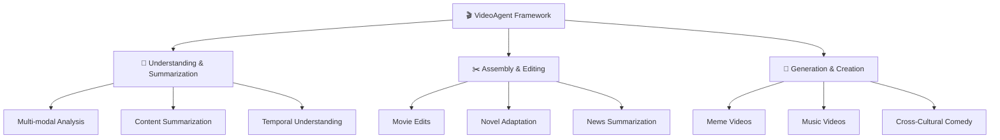

<div align="center">

# 🎬 VideoAgent: Multi-Modal Agent Framework for Video Processing

**🌟 Comprehensive Video Intelligence: Understanding, Editing, and Creation in One Framework**

<a href='https://space.bilibili.com/3546868449544308'></a>&nbsp;
<a href='https://www.youtube.com/@AI-Creator-is-here'></a>&nbsp;
&nbsp;


</div>

---

**VideoAgent** is a cutting-edge multi-modal agent framework that revolutionizes video processing through artificial intelligence. From intelligent video analysis to creative content generation, VideoAgent empowers users with three core functionalities: **understanding and summarizing video content**, **assembling and editing video clips**, and **generating creative video content** using advanced AI technologies.

<div align="center">

### 🔥 **Why VideoAgent?**

| 🧠 **Intelligence** | ⚡ **Efficiency** | 🎨 **Creativity** |
|:---:|:---:|:---:|
| Advanced multi-modal understanding | Automated workflow processing | AI-powered content generation |
| Context-aware analysis | One-prompt video creation | Cross-cultural adaptation |

</div>

---

## 📢 Latest Updates

<div align="center">

| Date | 📈 Update | Status |
|:----:|:----------|:------:|
| **2025.05** | 🎯 Framework architecture update planned for enhanced modularity! | 🔄 Planning |
| **2025.04.24** | 📢 Enhanced visual perception capabilities for precise character recognition | ✅ Released |
| **2025.04.14** | 📢 Updated VideoAgent framework implementation and usage documentation! | ✅ Released |
| **2025.04.08** | 📢 Our demo videos have received **100k+ views** and **19k+ likes**! | 🎉 Milestone |
| **2025.04.07** | 📢 Released additional demo videos showcasing VideoAgent's diverse capabilities! | ✅ Released |
| **2025.04.07** | 📢 Released video retrieval implementation supporting all demonstrated functionalities! | ✅ Released |
| **2025.03.31** | 📢 Released audio processing modules for Generation & Creation capabilities! | ✅ Released |

</div>

---

## 🎯 **Core Capabilities**

<div align="center">



</div>

---

### 🧠 **1. Video Understanding & Summarization**

<div align="center">

**🚀 Transform videos into structured insights and intelligent summaries**

</div>

This cutting-edge module leverages advanced multi-modal understanding to extract meaningful information from video content and generate comprehensive textual descriptions. By analyzing visual scenes, audio content, and temporal dynamics, VideoAgent produces accurate and contextual summaries.

<details>
<summary><b>🔧 How VideoAgent Processes Video Understanding</b></summary>

- 📥 **Input Processing**: Accept video files of various formats and lengths
- 🔍 **Feature Extraction**: Automatically extract and analyze visual, audio, and temporal features  
- 📊 **Content Analysis**: Generate structured summaries based on comprehensive content analysis
- 🎛️ **Customization**: Support customizable output formats and detail levels

</details>

#### ✨ **Key Features:**

<div align="center">

| Feature | Description |
|:--------|:------------|
| 🎥🔊 **Multi-modal Analysis** | Combining visual and audio understanding |
| ⏱️ **Temporal Recognition** | Narrative structure and sequence analysis |
| 👤 **Character Identification** | Object and character recognition with context |
| 🎚️ **Customizable Output** | Adjustable summarization depth and focus |

</div>

> **🔮 [Placeholder for Understanding & Summarization Demo Examples]**
> 
> *Coming Soon: Comprehensive video analysis demonstrations showcasing intelligent content understanding and automated summarization capabilities.*

---

### ✂️ **2. Video Assembly & Editing**

<div align="center">

**🎬 Intelligent video compilation and editing based on user requirements**

</div>

This module specializes in assembling existing video materials into cohesive narratives through intelligent editing techniques. It focuses on content-aware cutting, music synchronization, and story-driven assembly without complex generative modifications.

<details>
<summary><b>🔧 How VideoAgent Handles Assembly & Editing</b></summary>

- 📁 **Source Management**: Accept video sources, audio tracks, and creative briefs
- 🎯 **Smart Analysis**: Automatically analyze content for optimal cutting points
- 🎵 **Music Sync**: Synchronize visuals with music rhythm and emotional beats
- 📖 **Story Assembly**: Generate storyboard-driven edits maintaining narrative coherence

</details>

#### ✨ **Key Features:**

<div align="center">

| Feature | Description |
|:--------|:------------|
| 🎵 **Rhythm-Aware Editing** | Music synchronization and beat matching |
| 🎬 **Scene-Based Assembly** | Content retrieval and intelligent compilation |
| 😊 **Emotion-Driven Construction** | Character and emotion-aware narrative building |
| 🎨 **Multi-Style Adaptation** | Flexible editing based on user prompts |

</div>

#### 🎬 **2.1 Movie Edits**

Transform movie footage into compelling montages that capture specific themes and emotions with perfect music synchronization.

<div align="center">

##### 🕷️ **2.1.1 *Spider-Man: Across the Spider-Verse***

[](https://www.bilibili.com/video/BV1C9Z6Y3ESo/)

</div>

**🌟 Demonstration Features:**
- ⚡ Perfect synchronization between visuals and background music rhythm (e.g., 13s, 22s, 25s)
- 🎯 Expert capture of high-energy scenes (<1 min) from full movie (>2 hours)
- 🔄 Visual continuity maintenance and redundancy reduction
- 📋 Accurate alignment with storyboard descriptions from user prompts

Through intelligent analysis of hours of film footage, VideoAgent automatically identifies **rhythm cues**, **high-energy action scenes**, and **character highlights** to achieve precise editing.

<details>
<summary><b>📝 View User Prompt</b></summary>

```
Begin with Gwen with blonde hair sitting at a dining table in front of a window, followed by her playing drums with pop textures and notes in the background. Include action scenes featuring Miguel O'Hara in his dark blue suit with red accents, sharp red claws and black/red eye lenses, Spider-Gwen in her white and pink suit with hood and ballet shoes, Miles Morales with curly hair and red spider logo on his chest, and The Spot in his black suit covered in white spots using portal powers. Focus on the chase scene in the blue sky with trains, and emphasize quality motion such as web-swinging, fighting, and colorful special effects throughout the sequence.
```

</details>

<div align="center">

##### 🌌 **2.1.2 *Interstellar***

[](https://www.bilibili.com/video/BV1yQZ6YkEkw/) [](https://www.bilibili.com/video/BV1koZ6YuEeL/)

</div>

**🌟 Demonstration Features:**
- 🎨 Multiple editing styles from identical source material based on different prompts

We showcase two distinct edits of *Interstellar* created using VideoAgent. The first version focuses on the theme "love transcending space and time," while the second emphasizes humanity's courage in space exploration.

<details>
<summary><b>📝 View User Prompts</b></summary>

```yaml
Version 1: "Love can transcend time and space."

Version 2: "Celebrate humanity's courage in space exploration. Include scenes featuring spaceships, wormholes, black holes, space station docking maneuvers, ocean planets, and glacial worlds. Show astronauts in their distinctive white spacesuits as they venture into the unknown, highlighting mankind's relentless drive to explore the cosmos."
```

</details>

<div align="center">

##### ⚔️ **2.1.3 *Nezha*** | 💕 **2.1.4 *Titanic***

[](https://www.bilibili.com/video/BV1NQZ6YCEPH/) [](https://www.bilibili.com/video/BV12mZ6YLEXJ/)

</div>

#### 📚 **2.2 Novel-to-Screen Adaptation**

Transform written narratives into compelling video content by intelligently matching textual descriptions with appropriate visual sequences.

<details>
<summary><b>🔧 How VideoAgent Creates Novel Adaptations</b></summary>

- 📖 **Source Processing**: Accept novel/book text files and video source materials
- 🎬 **Script Generation**: Automatically generate narrative scripts based on source text
- 🎯 **Scene Matching**: Match textual descriptions with appropriate visual elements
- 🎵 **Audio Integration**: Complete video assembly with audio integration

</details>

**✨ Key Features:**
- 📖 **Narrative Preservation**: Story structure maintenance from text to video
- 🎬 **Automated Scene Matching**: Ensuring story coherence and continuity
- 👥 **Character Consistency**: Maintaining character identity across sequences
- 🗣️ **Commentary Generation**: Intelligent audio integration

<div align="center">

[](https://www.bilibili.com/video/BV1TmZ6YjEvV/)

</div>

#### 📰 **2.3 News Summarization**

Transform lengthy interviews and news content into concise, engaging video summaries with accurate information extraction.

<details>
<summary><b>🔧 How VideoAgent Creates News Summaries</b></summary>

- 📰 **Content Processing**: Accept interview/news source files for summarization
- 🎤 **Transcription**: Automatically transcribe and extract key information
- 👤 **Entity Recognition**: Identify important people and events for highlight creation
- 🎬 **Video Assembly**: Complete video assembly with synchronized audio

</details>

<div align="center">

##### 🤖 **Tech News: OpenAI's GPT-4o** | 🏜️ **Dune 2 Cast Interview**

[](https://www.bilibili.com/video/BV12mZ6YLEqW/) [](https://www.bilibili.com/video/BV1m1Z6Y2Erb/)

</div>

---

### 🎨 **3. Video Generation & Creation**

<div align="center">

**🚀 Advanced video creation using multi-modal generative technologies**

</div>

This module leverages cutting-edge AI technologies including voice cloning, face replacement, and style transfer to create entirely new video content. It specializes in transforming existing materials through sophisticated generative processes.

<details>
<summary><b>🔧 How VideoAgent Handles Generation & Creation</b></summary>

- 🎯 **Input Processing**: Accept source videos and transformation requirements
- 🎭 **Generative Techniques**: Apply multi-modal generative techniques including voice synthesis and visual effects
- 🔧 **Content Integration**: Integrate generated content with original materials
- ✅ **Quality Assurance**: Ensure consistency and quality across generated elements

</details>

#### ✨ **Key Features:**

<div align="center">

| Feature | Description |
|:--------|:------------|
| 🗣️ **Voice Cloning** | Advanced speech synthesis capabilities |
| 👤 **Face Replacement** | Character transformation technology |
| 🎨 **Style Transfer** | Visual effect generation and adaptation |
| 🌍 **Cross-Cultural Adaptation** | Content localization and cultural conversion |

</div>

#### 😂 **3.1 Meme Videos**

Create engaging and viral-worthy meme content by intelligently transforming video materials with AI-generated audio and visual effects.

<div align="center">

##### 🥋 **Master Ma as AI Researcher** | 🗡️ **Xiao-Ming-Jian-Mo Series**

[](https://www.bilibili.com/video/BV1ucZ6YmEBU/) [](https://www.bilibili.com/video/BV1gFZ6YEE5W)

</div>

#### 🎵 **3.2 AI Music Videos**

Create comprehensive music videos by generating lyrics, synthesizing vocals, and matching visuals to create engaging musical content.

<div align="center">

[](https://www.bilibili.com/video/BV1t8ZCYsEeA/)

</div>

#### 🎭 **3.3 Cross-Cultural Verbal Comedy Arts**

Bridge cultural gaps through comedy by transforming content between different cultural contexts while preserving humor and entertainment value.

<div align="center">

##### 🇺🇸➡️🇨🇳 **Stand-up to Crosstalk** | 🇨🇳➡️🇺🇸 **Crosstalk to Stand-up**

[](https://www.bilibili.com/video/BV1ucZ6YmESg/) [](https://www.bilibili.com/video/BV13oZzYnEZq/)

</div>

---

## 🛠️ **Installation and Setup**

### 📥 **Clone and Install**

```bash
# Clone the repository
git clone https://github.com/HKUDS/VideoAgent.git

# Create and activate conda environment
conda create --name videoagent python=3.10
conda activate videoagent

# Install dependencies
conda install -y -c conda-forge pynini==2.1.5 ffmpeg
pip install -r requirements.txt
```

### 📦 **Model Download**

<details>
<summary><b>🔧 Download Required Models (Click to expand)</b></summary>

```bash
# Make sure git-lfs is installed (https://git-lfs.com)
git lfs install

# Download CosyVoice
cd tools/CosyVoice
huggingface-cli download PillowTa1k/CosyVoice --local-dir pretrained_models

# Download fish-speech
cd tools/fish-speech
huggingface-cli download fishaudio/fish-speech-1.5 --local-dir checkpoints/fish-speech-1.5

# Download seed-vc
cd tools/seed-vc
huggingface-cli download PillowTa1k/seed-vc --local-dir checkpoints

# Download DiffSinger
cd tools/DiffSinger
huggingface-cli download PillowTa1k/DiffSinger --local-dir checkpoints

# Download MiniCPM
cd tools
git lfs clone https://huggingface.co/openbmb/MiniCPM-V-2_6-int4

# Download Whisper
cd tools
git lfs clone https://huggingface.co/openai/whisper-large-v3-turbo

# Download all-MiniLM-L6-v2
cd tools
git lfs clone https://huggingface.co/sentence-transformers/all-MiniLM-L6-v2

# Download ImageBind
cd tools
mkdir .checkpoints
cd .checkpoints
wget https://dl.fbaipublicfiles.com/imagebind/imagebind_huge.pth
```

</details>

### ⚙️ **Configuration**

#### 🤖 **LLM Configuration**

```yaml
# VideoAgent/environment/config/config.yml 
# Input your LLM API credentials
llm:
  api_key: YOUR_API_KEY
  base_url: YOUR_BASE_URL
```

#### 🎛️ **Module-Specific Configuration**

Configure input parameters for different capabilities in their respective configuration files:

```yaml
# Example: VideoAgent/environment/config/cross_talk.yml
cross_talk:
  reqs: 'Generate a Chinese crosstalk (Xiangsheng) script. The story should be based on objectively existing situations, set against a Chinese background, avoiding examples from other countries. The script should be approximately 40-50 sentences long.'
  audio_path: 'dataset/cross_talk/英文脱口秀1.wav'
  dou_gen: 'dataset/cross_talk/郭德纲'
  peng_gen: 'dataset/cross_talk/付航'
  output: "dataset/user_output_video/cross_talk_video.mp4"
  video_source_dir: "dataset/user_video/"
```

#### 👤 **Character Recognition Enhancement**

```bash
# Add character images under dataset/video_edit/face_db for enhanced visual retrieval
# Folder structure should match character names:

face_db/
├── Spiderman/
│   └── image01.png
└── Batman/
    └── image02.png
```

### 🚀 **Usage**

```bash
# Run VideoAgent
python main.py

# The console will prompt:
# Please describe the type of video you would like to produce:
```

---

## 📊 **Model Requirements by Capability**

<div align="center">

| 🎯 **Capability** | 🎬 **Demo Type** | 🤖 **Required Models** |
|:------------------|:-----------------|:------------------------|
| 🎨 **Generation & Creation** | Cross-Cultural Comedy | `CosyVoice`, `MiniCPM`, `Whisper`, `ImageBind`, `all-MiniLM-L6-v2` |
| 🎨 **Generation & Creation** | Meme Videos (TTS) | `fish-speech` |
| 🎨 **Generation & Creation** | Music Videos | `DiffSinger`, `seed-vc`, `MiniCPM`, `Whisper`, `ImageBind`, `all-MiniLM-L6-v2` |
| ✂️ **Assembly & Editing** | Movie Edits | `MiniCPM`, `Whisper`, `ImageBind`, `all-MiniLM-L6-v2` |
| ✂️ **Assembly & Editing** | Novel Adaptation | `MiniCPM`, `Whisper`, `ImageBind`, `all-MiniLM-L6-v2` |
| ✂️ **Assembly & Editing** | News Summarization | `MiniCPM`, `Whisper`, `ImageBind`, `all-MiniLM-L6-v2` |

</div>

---

## 📚 **Documentation**

<div align="center">

[](https://o86nig8lht.feishu.cn/docx/P86mdzslVowcz7xuGJ0cE7n0n2b?from=from_copylink)

*For detailed documentation in Chinese, please refer to our comprehensive guide*

</div>

---

## 🤝 **Acknowledgements**

We express our deepest gratitude to the numerous individuals and organizations that have made VideoAgent possible. This framework stands on the shoulders of giants, benefiting from the collective wisdom of the open-source community and the groundbreaking work of AI researchers worldwide.

### 🔧 **Open-Source Community and AI Service Providers**

<div align="center">

| Project | Description | Link |
|:--------|:------------|:-----|
| 🎤 **CosyVoice** | Advanced voice synthesis | [](https://github.com/FunAudioLLM/CosyVoice) |
| 🐟 **Fish Speech** | High-quality TTS system | [](https://github.com/fishaudio/fish-speech) |
| 🌱 **Seed-VC** | Voice conversion technology | [](https://github.com/Plachtaa/seed-vc) |
| 🎵 **DiffSinger** | Neural singing voice synthesis | [](https://github.com/MoonInTheRiver/DiffSinger) |
| 📺 **VideoRAG** | Video retrieval framework | [](https://github.com/HKUDS/VideoRAG) |
| 🔗 **ImageBind** | Multi-modal embedding | [](https://github.com/facebookresearch/ImageBind) |
| 🎧 **Whisper** | Speech recognition | [](https://github.com/openai/whisper) |
| 💻 **MiniCPM** | Efficient language model | [](https://github.com/OpenBMB/MiniCPM-o) |

</div>

### 🎨 **Content Creators and Inspiration**

Our work has been significantly enriched by the creative contributions of content creators across various platforms. We acknowledge:

- 🎬 **Content Creators**: The talented creators behind the original video content used for testing and demonstration
- 🎭 **Comedy Artists**: Those whose work inspired our cross-cultural adaptations  
- 🎥 **Filmmakers**: The production teams behind the movies and TV shows featured in our demos

<div align="center">

> **⚠️ Note**: All content used in our demonstrations is for research purposes only. We deeply respect the intellectual property rights of all content creators and welcome any concerns or feedback regarding content usage.

</div>

**🙏 Special Attribution**: Spider-Man movie editing concept inspired by Douyin account [@我是不是zx](https://www.douyin.com/user/MS4wLjABAAAApVuuGxyM7CI4MJRHQvc6SAy0J2zrJ12eg3f5jFqCIXk?from_tab_name=main&vid=7468621366913273115)

---

<div align="center">

**🌟 Star us on GitHub if VideoAgent helps you create amazing videos! 🌟**

[](https://github.com/hkuds/videoagent)

</div>