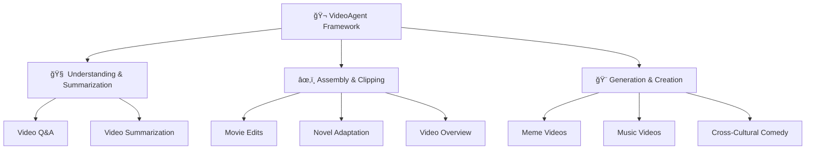

<div align="center">


<!-- # Open Agentic Video Intelligence -->
<br>

**🌟 Comprehensive Video Intelligence: An All-in-One Framework for Understanding, Editing, and Remaking**

<a href='https://space.bilibili.com/3546868449544308'></a>&nbsp;
<a href='https://www.youtube.com/@AI-Creator-is-here'></a>&nbsp;


</div>

---

## 🚀 Key Features

🧠 - **Understanding Video Content**<br>
Enable in-depth analysis, summarization, and insight extraction from video media with advanced multi-modal intelligence capabilities.

✂️ - **Editing Video Clips**<br>
Provide intuitive tools for assembling, clipping, and reconfiguring content with seamless workflow integration.

🎨 - **Remaking Creative Videos**<br>
Utilize generative technologies to produce new, imaginative video content through AI-powered creative assistance.

🔧 - **Multi-Modal Agentic Framework**<br>
Deliver comprehensive video intelligence through an integrated framework that combines multiple AI modalities for enhanced performance.

🚀 - **Seamless Natural Language Experience**<br>
Transform video interaction and creation through pure conversational AI - no complex interfaces or technical expertise required, just natural dialogue with VideoAgent.

---

## 📑 Table of Contents

- [🌟 System Overview](#system-overview)
- [🔧 Evaluation](#evaluation)
- [🚀 Quick Start](#quick-start)
- [🛠️ Development](#development)
- [🗣️ Text-to-Speech Integration](#text-to-speech-integration)
- [📚 Examples](#examples)
- [❓ FAQ](#faq)
- [📜 License](#license)
- [💖 Acknowledgments](#acknowledgments)


### 🔥 **Why VideoAgent?**

| 🧠 **Intelligence** | 🚀 **User-Friendly** | 🎨 **Creativity** |
|:---:|:---:|:---:|
| Advanced multi-modal understanding | Easy-to-use with minimal expertise required | Generative content creation |
| Context-aware analysis | One-prompt video creation | Cross-cultural adaptation |

</div>

---


## 🌟System Overview

<div align="center">




</div>

---

## 🔧Evaluation
We conduct extensive experiments across multiple dimensions to validate the effectiveness of VideoAgent in addressing key challenges.

<div align="center">
    <br>
    <div style="display: flex; justify-content: center; width: 100%; flex-wrap: nowrap;">
        
        
    </div>
</div>

---

## 🎯 Demos

<table>
<tr>
<td align="center" width="33%">
<a href="https://www.bilibili.com/video/BV1C9Z6Y3ESo/" target='_blank'></a>
Movie Edits
</td>
<td align="center" width="33%">
<a href="https://www.bilibili.com/video/BV1ucZ6YmEBU/" target='_blank'></a>
Meme Videos
</td>
<td align="center" width="33%">
<a href="https://www.bilibili.com/video/BV1t8ZCYsEeA/" target='_blank'></a>
Music Videos
</td>
</tr>
<tr>
<td align="center" width="33%">
<a href="https://www.bilibili.com/video/BV1ucZ6YmESg/" target='_blank'></a>
Verbal Comedy Arts
</td>
<td align="center" width="33%">
<a href="https://www.bilibili.com/video/BV1TmZ6YjEvV/" target='_blank'></a>
TV Drama
</td>
<td align="center" width="33%">
<a href="https://www.bilibili.com/video/BV12mZ6YLEqW/" target='_blank'></a>
News Summarization
</td>
</tr>
</table>

You can find more fun videos on our Bilibili channel here:  
👉 [Bilibili Homepage](https://space.bilibili.com/3546868449544308)  
Feel free to check it out for more entertaining content! 😊  

**Note**: All videos are used for research and demonstration purposes only. The audio and visual assets are sourced from the Internet. Please contact us if you believe any content infringes upon your intellectual property rights.

---


### 🧠 **1. Video Understanding & Summarization**


**🚀 Transform videos into structured insights and intelligent summaries**

</div>

This module leverages advanced multi-modal understanding to extract meaningful information from video content and generate comprehensive textual descriptions. By analyzing visual scenes, audio content, and temporal dynamics, VideoAgent produces accurate and contextual summaries.

<details>
<summary><b>🔧 How VideoAgent Processes Video Understanding</b></summary>

- 🔍 **Audio Extraction**: Automatically extract audio features  
- 📊 **Content Analysis**: Generate structured summaries based on comprehensive content analysis
- 🎛️ **Customization**: Support customizable output formats and detail levels

</details>

#### ✨ **Key Features:**


| Feature | Description |
|:--------|:------------|
| 🎥 **Multi-modal Analysis** | Combining visual and audio understanding |
| 🔊 **Transcription-based Q&A** | Interactive Q&A with video events |
| 🎚️ **Customizable Output** | Adjustable summarization depth and focus |

</div>

##### 🤖 **1.1 *Grok 4 Released***

<a href="https://www.youtube.com/watch?v=MtYsUdfZPMA&t=26s" target='_blank'></a>

📝 **Summarization Demo**:
```
XAI Releases Grok 4 Model: Breakthrough Reasoning Capabilities and Tool Usage
XAI's newly released Grok 4 model demonstrates remarkable reasoning abilities and intelligence levels, showing significant improvements over previous generations. The model exhibits capabilities that surpass human experts in both academic and practical applications, particularly achieving breakthrough progress in reasoning and tool usage.

Training Scale and Computational Power
Grok 4's training scale increased approximately 100-fold compared to Grok 2, utilizing XAI's Colossus supercomputer equipped with 200,000 GPUs. Compared to Grok 3, Grok 4 invested 10 times more computational resources in reinforcement learning, significantly enhancing its reasoning capabilities. As the XAI team states: "From Grok 3 to Grok 4, we actually invested massive computational resources in reasoning and reinforcement learning."

Academic Performance
Grok 4 demonstrates exceptional performance across various academic benchmarks:

On the highly challenging "Humanities Last Exam" benchmark test, Grok 4 solved approximately 40% of problems, while Grok 4 Heavy (multi-agent version) solved nearly 50%. These problems span mathematics, natural sciences, engineering, and humanities at postdoctoral research difficulty levels.

In multiple authoritative mathematics competitions including the USA Mathematical Olympiad (USAMO) and Harvard-MIT Mathematics Tournament (HMMT), Grok 4 Heavy achieved perfect scores.

On the ArcAGI v2 benchmark test, Grok 4 reached 15.8% accuracy—double that of the second-place model and the only model to break the 10% accuracy threshold in three months.

Reasoning and Tool Usage Capabilities
Grok 4's most significant advancement lies in its reasoning and tool usage abilities:

Tool Usage: Unlike Grok 3, Grok 4 integrated tool usage capabilities during training rather than relying solely on generalization. This enables more reliable use of various tools to solve complex problems.

Multi-Agent Collaboration: The Grok 4 Heavy version can run multiple agents simultaneously that work independently before comparing results, similar to a "study group" collaborating to reach optimal answers.

Search and Research Capabilities: Grok 4 can search the internet, gather information, and conduct in-depth analysis, as demonstrated in its analysis of X platform data and sports event predictions.

Practical Application Value
Grok 4 shows tremendous potential in real-world applications:

Business Decisions: In VendingBench business simulations, Grok 4 achieved net assets twice as high as other top models, demonstrating superior long-term planning and strategic execution capabilities.

Scientific Research: Arc Research Institute has begun using Grok 4 to automate CRISPR research workflows, helping scientists filter optimal hypotheses from millions of experimental logs.

Game Development: Developers can utilize Grok 4 to create complete games in just a few hours, including automated resource collection and game logic programming.

Limitations and Future Development
Despite Grok 4's excellent performance, some limitations remain:

Weak Multimodal Capabilities: Grok 4 still has shortcomings in image understanding and generation. The XAI team is training a 7th version base model to address this issue.

Data Bottleneck: As models become increasingly intelligent, finding challenging problems and reliable feedback signals becomes increasingly difficult.

Future development directions include:

Specialized Coding Models: The team is developing dedicated coding models that are both fast and intelligent, expected to launch within weeks.

Enhanced Multimodal Capabilities: The next-generation pre-training model will show significant improvements in image, video, and audio understanding.

Video Generation: XAI plans to begin training video models within the next 3-4 weeks, using over 100,000 GB200 GPUs.

The release of Grok 4 marks a major advancement in AI technology, demonstrating XAI's ambition in advancing artificial general intelligence. As the team states: "We are at the beginning of an intelligence explosion—this is the most interesting period in human history."
```

##### 🎬 **1.2 *Dune: Part Two Cast Interview***

<a href="https://www.youtube.com/watch?v=AVQRnDFZ1Qs" target='_blank'></a>

📝 **Summarization Demo**:
```
In a thrilling exploration of Frank Herbert's "Dune," cast members reflect on the epic journey of bringing this iconic story to life on the big screen. They discuss the immense pressure of portraying Paul Atreides, with Timothy Chalamet sharing his experience of confronting prophecy and the challenges of evolving from a boy to a leader. Zendaya, who plays Chani, emphasizes the importance of finding human connections amidst the vast sci-fi landscape, describing their romantic relationship as one filled with conflict and pain.

As the story progresses, Austin Butler prepares for his role as the villain Fade Rautha Harkonnen, delving into the depths of his character with an intense commitment that includes months of training. Javier Bardem, portraying Stilgar, expresses the complexity of being a mentor to Paul while grappling with religious fanaticism. 

Florence Pugh introduces her character, Princess Rulan, revealing her calculated nature and her role in the power dynamics of the universe, while also highlighting the excitement of working alongside such talented actors. The cast reflects on their collaborative process with director Denis Villeneuve, acknowledging his passion and understanding of the source material, which shapes their performances.

The anticipation builds as the film promises grand action sequences and visually stunning scenes, compelling audiences to experience it on the big screen. Ultimately, the narrative weaves together themes of prophecy, love, and personal sacrifice, illustrating how these characters navigate fate and duty in their quest for identity and belonging.
```

#### 🔍 **1.3 Video Q&A**

📝 **Q&A Demonstration**:
```
Q: How many times have editors rejected the novel?
A: The novel was rejected 22 times by editors who thought it was too complex. This information can be found in the transcript around the first sentence.

Q: Where can I buy tickets?
A: You can buy tickets to Dune Part 2 on Fandango.com. This information is mentioned at the end of the transcript.
```


---

### ✂️ **2. Video Editing**


**🎬 Intelligent video compilation and clipping based on user requirements**

</div>

This module specializes in assembling existing video materials into cohesive narratives through intelligent editing techniques. It focuses on content-aware cutting, music synchronization, and story-driven assembly without complex generative modifications.

<details>
<summary><b>🔧 How VideoAgent Handles Assembly & Clipping</b></summary>

- 📁 **Source Management**: Accept video sources, audio tracks, and creative briefs
- 🎯 **Smart Analysis**: Automatically analyze content for optimal cutting points
- 🎵 **Music Sync**: Synchronize visuals with music rhythm and emotional beats
- 📖 **Story Assembly**: Generate storyboard-driven edits maintaining narrative coherence

</details>

#### ✨ **Key Features:**

| Feature | Description |
|:--------|:------------|
| 🎵 **Rhythm-Aware Editing** | Music synchronization and beat matching |
| 🎬 **Scene-Based Assembly** | Content retrieval and intelligent compilation |
| 😊 **Emotion-Driven Construction** | Character and emotion-aware narrative building |
| 🎨 **Multi-Style Adaptation** | Flexible editing based on user prompts |

</div>

#### 🎬 **2.1 Movie Edits**

Transform movie footage into compelling montages that capture specific themes and emotions with perfect music synchronization.

##### 🕷️ **2.1.1 *Spider-Man: Across the Spider-Verse***

<a href='https://www.bilibili.com/video/BV1C9Z6Y3ESo/' target='_blank'></a>

📝 **Prompt**:
```
Begin with Gwen with blonde hair sitting at a dining table in front of a window, followed by her playing drums with pop textures and notes in the background. Include action scenes featuring Miguel O'Hara in his dark blue suit with red accents, sharp red claws and black/red eye lenses, Spider-Gwen in her white and pink suit with hood and ballet shoes, Miles Morales with curly hair and red spider logo on his chest, and The Spot in his black suit covered in white spots using portal powers. Focus on the chase scene in the blue sky with trains, and emphasize quality motion such as web-swinging, fighting, and colorful special effects throughout the sequence.
```


#### 📚 **2.2 Novel-to-Screen Adaptation**

Transform written narratives into compelling video content by intelligently matching textual descriptions with appropriate visual sequences.

<details>
<summary><b>🔧 How VideoAgent Creates Novel Adaptations</b></summary>

- 📖 **Source Processing**: Accept novel/book text files and video source materials
- 🎬 **Script Generation**: Automatically generate narrative scripts based on source text
- 🎯 **Scene Matching**: Match textual descriptions with appropriate visual elements
- 🎵 **Audio Integration**: Complete video assembly with audio integration

</details>

<a href="https://www.bilibili.com/video/BV1TmZ6YjEvV/" target='_blank'></a>

📝 **Prompt:**
```
Write fluent commentary script with 1500 words.
```

#### 📰 **2.3 Video Overview**

Transform lengthy interviews and news event into concise, engaging video summaries with accurate information extraction.

<details>
<summary><b>🔧 How VideoAgent Creates Video Overview</b></summary>

- 📰 **Content Processing**: Accept interview/news source files for summarization
- 🎤 **Transcription**: Automatically transcribe and extract key information
- 👤 **Entity Recognition**: Identify important people and events for highlight creation
- 🎬 **Video Assembly**: Complete video assembly with synchronized audio

</details>

##### 🤖 **2.3.1 Tech News: OpenAI's GPT-4o Image Generation Release**

<table>
<tr>
<a href="https://www.bilibili.com/video/BV12mZ6YLEqW/" target='_blank'></a>
Tech News Overview made by VideoAgent
</td>
<a href="https://www.youtube.com/watch?v=2f3K43FHRKo" target='_blank'></a>
Original Tech Report
</td>
</tr>
</table>

📝 **Prompt:**
```
Short tech news, colloquial expression within 250 words, check the accuracy of key terms, e.g. the GPT model name should be 4o instead of 4.0
```


---

### 🎨 **3. Video Remaking**


**🚀 Advanced video creation using multi-modal generative technologies**

</div>

This module leverages generative technologies including voice cloning, face replacement, and style transfer to create entirely new video content. It specializes in transforming existing materials through sophisticated generative processes.

<details>
<summary><b>🔧 How VideoAgent Handles Generation & Creation</b></summary>

- 🎯 **Input Processing**: Accept source videos and transformation requirements
- 🎭 **Generative Techniques**: Apply multi-modal generative techniques including voice synthesis and visual effects
- 🔧 **Content Integration**: Integrate generated content with original materials
- ✅ **Quality Assurance**: Ensure consistency and quality across generated elements

</details>

#### ✨ **Key Features:**

| Feature | Description |
|:--------|:------------|
| 🗣️ **Voice Cloning** | Advanced speech synthesis capabilities |
| 👤 **Face Replacement** | Character transformation technology |
| 🎨 **Style Transfer** | Visual effect generation and adaptation |
| 🌍 **Cross-Cultural Adaptation** | Content localization and cultural conversion |

</div>

#### 😂 **3.1 Meme Videos**

Create engaging and viral-worthy meme content by intelligently transforming video materials with AI-generated audio and visual effects.

**🔧 How VideoAgent Creates Meme Videos**
- Users just need to provide the video path and your requirements.
- Automatically preprocesses audio (voice separation, loudness normalization, resampling, transcription) with corresponding agents
- Automatically segments the audio and performs segment-level copywriting adaptation via the Writer Agent
- Uses the Infer Agent for zero-shot inference on audio segments
- Aligns and merges audio-visual content automatically with the Combiner Agent

##### 🥋 **3.1.1 Master Ma as AI Researcher**

<table>
<tr>
<a href='https://www.bilibili.com/video/BV1ucZ6YmEBU/' target='_blank'></a>
Master Ma as AI Researcher
</td>
<a href='https://www.bilibili.com/video/BV1584y1N7cR/' target='_blank'></a>
Original Video of Master Ma
</td>
</tr>
</table>

📝 **Prompt:**
```
Create a humorous narrative about two PhD students seeking advice from Master Ma. For the two PhD students, one of them is known for high citation counts and the other for numerous publications. Transform martial arts terms into AI research terminology while keeping phrase lengths similar (length difference should be less than two Chinese characters). The story highlights their academic rivalry and ends with Master Ma advising against "窝里斗" (internal competition). Keep signature phrases like "大意了没有闪" (wasn't cautious enough) and "四两拨千斤" (achieving great results with minimal effort) while avoiding mentions of real institutions. The word combinations should be logical and appropriate for an academic context.
```

##### 🗡️ **3.1.2 Xiao-Ming-Jian-Mo(小明剑魔) Meme Series**

<table>
<tr>
<a href='https://www.bilibili.com/video/BV1gFZ6YEE5W' target='_blank'></a>
Video 1: Mixue's Response
</td>
<a href='https://www.bilibili.com/video/BV1ucZ6YmE5x'></a>
Video 2: Find Your Own Problems
</td>
</tr>
<tr>
<a href='https://www.bilibili.com/video/BV1ucZ6YmEFQ' target='_blank'></a>
Video 3: MVP
</td>
<a href='https://www.bilibili.com/video/BV1ZYQzY5E1x' target='_blank'></a>
Video 4: Original 小明剑魔 Video
</td>
</tr>
</table>

The 小明剑魔 meme has gained massive popularity recently through his insightful yet comedic streaming commentary. Many content creators have successfully adapted his distinctive speech pattern into creative videos. We've used VideoAgent to generate three videos of this viral meme format, each capturing the unique style and energy of the original while adding new creative elements.

📝 **Prompts**:
```
Video 1:
Background: Mixue Ice Cream is a national chain brand focusing on ice cream and tea beverages. On March 15th (Consumer Rights Day), they were reported to be using overnight lemons. However, compared to other exposures, using overnight lemons isn't considered a particularly serious violation and is somewhat understandable.

- Speaker: Snow King (Mixue's representative)
- Purpose: Emphasize that the overnight lemon situation isn't too serious, highlighting Mixue's good reputation
- Must preserve the phrases "Look in my eyes tell me why why baby why", "回答我"
- Must end with the word "说话"
- Ensure natural and fluent sentences
```
```
Video 2:
Based on the following scenario, create an angry rebuttal from Zhuge Liang:
- Speaker: Zhuge Liang
- Start with "北伐失败怎么不找找自己问题" (Why don't you look at your own problems for the failure of the Northern Expedition), followed by "...找自己问题" pattern sentences that all reference anime events
- Anime examples must mention specific characters
- Only the last "...找自己问题" should return to the Northern Expedition scenario
- Use colloquial language and diverse anime references
```
```
Video 3:
Based on the following scenario, create an angry rebuttal from Zhuge Liang:
- Speaker: Zhuge Liang
- Challenged about why a certain Three Kingdoms character has a higher rating and launches a fierce rebuttal
- Must include: "三点零、十三点零、躺赢狗"
- Do not start with "零杠几"
- Later rating comparisons should show stark differences (can be exaggerated)
- Use colloquial language, align with historical facts
```

#### 🎵 **3.2 AI Music Videos**

Create comprehensive music videos by generating lyrics, synthesizing vocals, and matching visuals to create engaging musical content.

**🔧 How VideoAgent Creates Music Videos**
- Users just need to provide the music MIDI file, original lyrics, BGM file (optional), target voice file, and requirements. 
- Automatically performs loudness normalization and annotates the MIDI file using the Annotator Agent.
- Automatically calibrates and adapts lyrics at the word level via the Analyzer Agent.
- Automatically divides long rest intervals to reduce melodic errors and enables song covers.

<a href='https://www.bilibili.com/video/BV1t8ZCYsEeA/' target='_blank'></a>

📝 **Prompts**:
```
The song is performed by Patrick Star, focusing on the theme of "the struggles of manuscript submission and dealing with overly critical reviewers", following the original lyrics' sentence structure while replacing specific content. It incorporates elements of reviewer nitpicking (e.g., questioning innovation, demanding redundant experiments) and expresses frustration with lines like "If only I could swap reviewers, this academic fate is too cruel" to highlight the emotional toll of peer review.
```

#### 🎭 **3.3 Cross-Cultural Verbal Comedy Arts**

Bridge cultural gaps through comedy by transforming content between different cultural contexts while preserving humor and entertainment value.

**🔧 How VideoAgent Creates Cross-Cultural Comedy**
- Users just need to provide the target cross-talk (comedy dialogue) audio file.
- Automatically adapts the script based on the provided target audio file.
- Automatically selects the appropriate vocal tone for voice cloning according to the emotional context of the script.

##### 🇺🇸➡️🇨🇳 **3.3.1 English Stand-up Comedy to Chinese Crosstalk**

<table>
<tr>
<a href="https://www.bilibili.com/video/BV1ucZ6YmESg/" target='_blank'></a>
Chinese Crosstalk Adaptation
</td>
<a href="https://www.bilibili.com/video/BV1u1421t78T" target='_blank'></a>
Original Stand-up Comedy Segment
</td>
</tr>
</table>

##### 🇨🇳➡️🇺🇸 **3.3.2 Chinese Crosstalk to English Stand-up Comedy**

<table>
<tr>
<a href="https://www.bilibili.com/video/BV13oZzYnEZq/" target='_blank'></a>
Stand-up Comedy Adaptation
</td>
<a href="https://www.bilibili.com/audio/au4765690/" target='_blank'></a>
Original Chinese Crosstalk Segment
</td>
</tr>
</table>

---

## 🚀Quick Start

### 📥 **Clone and Install**

```bash
git clone https://github.com/HKUDS/VideoAgent.git
conda create --name videoagent python=3.10
conda activate videoagent
conda install -y -c conda-forge pynini==2.1.5 ffmpeg
pip install -r requirements.txt
```

### 📦 **Model Download**

```bash
# Download CosyVoice
cd tools/CosyVoice
huggingface-cli download PillowTa1k/CosyVoice --local-dir pretrained_models
```

```bash
# Download fish-speech
cd tools/fish-speech
huggingface-cli download fishaudio/fish-speech-1.5 --local-dir checkpoints/fish-speech-1.5
```

```bash
# Download seed-vc
cd tools/seed-vc
huggingface-cli download PillowTa1k/seed-vc --local-dir checkpoints
```

```bash
# Download DiffSinger
cd tools/DiffSinger
huggingface-cli download PillowTa1k/DiffSinger --local-dir checkpoints
```

```bash
# Download Whisper
cd tools
huggingface-cli download openai/whisper-large-v3-turbo --local-dir whisper-large-v3-turbo
```

```bash
# Make sure git-lfs is installed (https://git-lfs.com)
git lfs install
```

```bash
# Download ImageBind
cd tools
mkdir .checkpoints
cd .checkpoints
wget https://dl.fbaipublicfiles.com/imagebind/imagebind_huge.pth
```

**🌟Multiple models are available for your convenience; you may wish to download only those relevant to your project.**


<table>
  <tr>
    <th align="center">Feature Type</th>
    <th align="center">Video Demo</th>
    <th align="center">Required Models</th>
  </tr>
  <tr>
    <td align="center">Cross Talk</td>
    <td align="center">English Stand-up Comedy to Chinese Crosstalk</td>
    <td align="center">CosyVoice, Whisper, ImageBind</td>
  </tr>
  <tr>
    <td align="center">Talk Show</td>
    <td align="center">Chinese Crosstalk to English Stand-up Comedy</td>
    <td align="center">CosyVoice, Whisper, ImageBind</td>
  </tr>
  <tr>
    <td align="center">MAD TTS</td>
    <td align="center">Xiao-Ming-Jian-Mo(小明剑魔) Meme</td>
    <td align="center">fish-speech</td>
  </tr>
  <tr>
    <td align="center">MAD SVC</td>
    <td align="center">AI Music Videos</td>
    <td align="center">DiffSinger, seed-vc, Whisper, ImageBind</td>
  </tr>
  <tr>
    <td align="center">Rhythm</td>
    <td align="center">Spider-Man: Across the Spider-Verse</td>
    <td align="center">Whisper, ImageBind</td>
  </tr>
  <tr>
    <td align="center">Comm</td>
    <td align="center">Novel-to-Screen Adaptation</td>  
    <td align="center">CosyVoice, Whisper, ImageBind</td>
  </tr>
  <tr>
    <td align="center">News</td>
    <td align="center">Tech News: OpenAI's GPT-4o Image Generation Release</td>
    <td align="center">CosyVoice, Whisper, ImageBind</td>
  </tr>
  <tr>
    <td align="center">Video QA/Summarization</td>
    <td align="center">Dune 2 Movie Cast Update Podcast</td>
    <td align="center">Whisper</td>
  </tr>
</table>

</div>

### 🤖 **LLM Configuration**

```bash
# VideoAgent\environment\config\config.yml 
llm:

  # Video Remixing/TTS/SVC/Stand-up/CrossTalk
  deepseek_api_key: ""  
  deepseek_base_url: ""  

  # Agentic Graph Router/TTS/SVC/Stand-up/CrossTalk
  claude_api_key: ""  
  claude_base_url: ""

  # Video Editing/Overview/Summarization/QA/Commentary Video
  gpt_api_key: ""  
  gpt_base_url: ""  

  # MLLM for caption and fine-grained video understanding
  gemini_api_key: ""  
  gemini_base_url: ""  
```

### 🚀 **Usage**

```bash
# With the configuration now complete, proceed to run the following instructions:
python main.py
# The console will output:
User Requirement: ...
# Requirement Example:
# 1. I need to create a reworded version of an existing video where the speech content is modified while maintaining the original speaker's voice. The video should have the same visuals as the original, but with updated dialogue that follows my specific requirements.
# 2. I have a standup comedy script that I'd like to turn into a professional-looking video. I need the script to be performed with good comedic timing and audience reactions, then matched with relevant video footage to create a complete standup comedy special. I already have a reference script and some footage I want to use for the video.


```

---

## 📚 **Documentation**

For detailed documentation in Chinese, please refer to our [comprehensive guide](https://o86nig8lht.feishu.cn/docx/P86mdzslVowcz7xuGJ0cE7n0n2b?from=from_copylink).

---

## 🤝 **Acknowledgements**

We express our deepest gratitude to the numerous individuals and organizations that have made VideoAgent possible. This framework stands on the shoulders of giants, benefiting from the collective wisdom of the open-source community and the groundbreaking work of researchers worldwide.

### 🔧 **Open-Source Community and Service Providers**

- [CosyVoice](https://github.com/FunAudioLLM/CosyVoice)
- [Fish Speech](https://github.com/fishaudio/fish-speech)
- [Seed-VC](https://github.com/Plachtaa/seed-vc)
- [DiffSinger](https://github.com/MoonInTheRiver/DiffSinger)
- [VideoRAG](https://github.com/HKUDS/VideoRAG)
- [ImageBind](https://github.com/facebookresearch/ImageBind)
- [Whisper](https://github.com/openai/whisper)
- [Librosa](https://github.com/librosa/librosa)


### 🎨 **Content Creators and Inspiration**

Our work has been significantly enriched by the creative contributions of content creators across various platforms. We acknowledge:

- 🎬 **Content Creators**: The talented creators behind the original video content used for testing and demonstration
- 🎭 **Comedy Artists**: Those whose work inspired our cross-cultural adaptations  
- 🎥 **Filmmakers**: The production teams behind the movies and TV shows featured in our demos

**⚠️ Note**: All content used in our demonstrations is for research purposes only. We deeply respect the intellectual property rights of all content creators and welcome any concerns or feedback regarding content usage.

**🙏 Special Attribution**: Spider-Man movie editing concept inspired by Douyin account [@我是不是zx](https://www.douyin.com/user/MS4wLjABAAAApVuuGxyM7CI4MJRHQvc6SAy0J2zrJ12eg3f5jFqCIXk?from_tab_name=main&vid=7468621366913273115)
