<div align="center">


<!-- # Open Agentic Video Intelligence -->
<br>

**🌟 Comprehensive Video Intelligence: Understanding, Clipping, and Creation in One Framework**

<a href='https://space.bilibili.com/3546868449544308'></a>&nbsp;
<a href='https://www.youtube.com/@AI-Creator-is-here'></a>&nbsp;


</div>

---

**VideoAgent** is a multi-modal agent framework that provides comprehensive video processing capabilities. Leveraging state-of-the-art multimodal models and agent framework designs, VideoAgent enables sophisticated video analysis, intelligent editing, and creative content generation. The framework empowers users with three core functionalities: **understanding and summarizing video content**, **assembling and clipping video sequences**, and **generating creative video content** using generative technologies.

<div align="center">


### 🔥 **Why VideoAgent?**

| 🧠 **Intelligence** | 🚀 **User-Friendly** | 🎨 **Creativity** |
|:---:|:---:|:---:|
| Advanced multi-modal understanding | Easy-to-use with minimal expertise required | Generative content creation |
| Context-aware analysis | One-prompt video creation | Cross-cultural adaptation |

</div>

---

## 📢 Latest Updates

<div align="center">

| Date | 📈 Update | Status |
|:----:|:----------|:------:|
| **2025.07** | 📢 Released Understanding & Summarization applications and demos! | ✅ Released |
| **2025.06** | 📢 Completed comparative experiments, technical details will be released! | 🔄 Will be released |
| **2025.05** | 🎯 Framework architecture update completed for enhanced modularity! | ✅ Completed |
| **2025.04.24** | 📢 Enhanced visual perception capabilities for precise character recognition | ✅ Released |
| **2025.04.14** | 📢 Updated VideoAgent framework implementation and usage documentation! | ✅ Released |
| **2025.04.08** | 📢 Our demo videos have received **100k+ views** and **19k+ likes**! | 🎉 Milestone |
| **2025.04.07** | 📢 Released additional demo videos showcasing VideoAgent's diverse capabilities! | ✅ Released |
| **2025.04.07** | 📢 Released video retrieval implementation supporting all demonstrated functionalities! | ✅ Released |
| **2025.03.31** | 📢 Released audio processing modules for Generation & Creation capabilities! | ✅ Released |

</div>

---

## 🎯 **Core Capabilities**

```mermaid
graph TB
    A[🎬 VideoAgent Framework] --> B[🧠 Understanding & Summarization]
    A --> C[✂️ Assembly & Clipping]
    A --> D[🎨 Generation & Creation]
    
    B --> B1[Multi-modal Analysis]
    B --> B2[Content Summarization]
    B --> B3[Temporal Understanding]
    
    C --> C1[Movie Edits]
    C --> C2[Novel Adaptation]
    C --> C3[News Summarization]
    
    D --> D1[Meme Videos]
    D --> D2[Music Videos]
    D --> D3[Cross-Cultural Comedy]
```

<div align="center">




</div>

---

### 🧠 **1. Video Understanding & Summarization**

<div align="center">

**🚀 Transform videos into structured insights and intelligent summaries**

</div>

This module leverages advanced multi-modal understanding to extract meaningful information from video content and generate comprehensive textual descriptions. By analyzing visual scenes, audio content, and temporal dynamics, VideoAgent produces accurate and contextual summaries.

<details>
<summary><b>🔧 How VideoAgent Processes Video Understanding</b></summary>

- 📥 **Input Processing**: Accept video files of various formats and lengths
- 🔍 **Feature Extraction**: Automatically extract and analyze visual, audio, and temporal features  
- 📊 **Content Analysis**: Generate structured summaries based on comprehensive content analysis
- 🎛️ **Customization**: Support customizable output formats and detail levels

</details>

#### ✨ **Key Features:**

<div align="center">

| Feature | Description |
|:--------|:------------|
| 🎥🔊 **Multi-modal Analysis** | Combining visual and audio understanding |
| ⏱️ **Temporal Recognition** | Narrative structure and sequence analysis |
| 👤 **Character Identification** | Object and character recognition with context |
| 🎚️ **Customizable Output** | Adjustable summarization depth and focus |

</div>

> **🔮 [Placeholder for Understanding & Summarization Demo Examples]**
> 
> *Coming Soon: Comprehensive video analysis demonstrations showcasing intelligent content understanding and automated summarization capabilities.*

---

### ✂️ **2. Video Assembly & Clipping**

<div align="center">

**🎬 Intelligent video compilation and clipping based on user requirements**

</div>

This module specializes in assembling existing video materials into cohesive narratives through intelligent editing techniques. It focuses on content-aware cutting, music synchronization, and story-driven assembly without complex generative modifications.

<details>
<summary><b>🔧 How VideoAgent Handles Assembly & Clipping</b></summary>

- 📁 **Source Management**: Accept video sources, audio tracks, and creative briefs
- 🎯 **Smart Analysis**: Automatically analyze content for optimal cutting points
- 🎵 **Music Sync**: Synchronize visuals with music rhythm and emotional beats
- 📖 **Story Assembly**: Generate storyboard-driven edits maintaining narrative coherence

</details>

#### ✨ **Key Features:**

<div align="center">

| Feature | Description |
|:--------|:------------|
| 🎵 **Rhythm-Aware Editing** | Music synchronization and beat matching |
| 🎬 **Scene-Based Assembly** | Content retrieval and intelligent compilation |
| 😊 **Emotion-Driven Construction** | Character and emotion-aware narrative building |
| 🎨 **Multi-Style Adaptation** | Flexible editing based on user prompts |

</div>

#### 🎬 **2.1 Movie Edits**

Transform movie footage into compelling montages that capture specific themes and emotions with perfect music synchronization.

##### 🕷️ **2.1.1 *Spider-Man: Across the Spider-Verse***

<a href='https://www.bilibili.com/video/BV1C9Z6Y3ESo/' target='_blank'></a>

**🌟 Key Features:**
- Perfect sync between visuals and background music rhythm (eg. 13s, 22s, 25s)
- Expert capture of high-energy scenes (<1 min) from the full movie (>2 hours)
- Maintain visual continuity and reduce redundant clips
- Accurately align the storyboard description of the user prompt (eg. 1st, 2nd sections)

Through intelligent analysis of hours of film footage, VideoAgent automatically identifies **rhythm cues**, **high-energy action scenes**, and **character highlights** to achieve precise editing.

📝 **Prompt**:
```
Begin with Gwen with blonde hair sitting at a dining table in front of a window, followed by her playing drums with pop textures and notes in the background. Include action scenes featuring Miguel O'Hara in his dark blue suit with red accents, sharp red claws and black/red eye lenses, Spider-Gwen in her white and pink suit with hood and ballet shoes, Miles Morales with curly hair and red spider logo on his chest, and The Spot in his black suit covered in white spots using portal powers. Focus on the chase scene in the blue sky with trains, and emphasize quality motion such as web-swinging, fighting, and colorful special effects throughout the sequence.
```

##### 🌌 **2.1.2 *Interstellar***

<a href='https://www.bilibili.com/video/BV1yQZ6YkEkw/' target='_blank'></a>&nbsp;&nbsp;&nbsp;&nbsp;&nbsp;&nbsp;&nbsp;
<a href='https://www.bilibili.com/video/BV1koZ6YuEeL/' target='_blank'></a>

**🌟 Key Features:**
- For the same input video, edit different styles by adapting your prompts

We showcase two distinct edits of *Interstellar* created using VideoAgent. The first version focuses on the theme "love transcending space and time," while the second emphasizes humanity's courage in space exploration. Both edits demonstrate how different prompts can shape the narrative and emotional impact of the same source material.

📝 **Prompt**:
```
Version 1:
Love can transcend time and space.
```
```
Version 2:
Celebrate humanity's courage in space exploration. Include scenes featuring spaceships, wormholes, black holes, space station docking maneuvers, ocean planets, and glacial worlds. Show astronauts in their distinctive white spacesuits as they venture into the unknown, highlighting mankind's relentless drive to explore the cosmos.
```

##### ⚔️ **2.1.3 *Nezha***

<a href='https://www.bilibili.com/video/BV1NQZ6YCEPH/' target='_blank'></a>

**🌟 Key Features:**
- Capturing scenes of conflicts and battles

📝 **Prompt:**
```
Capture more scenes of conflicts and battles between Nezha and Shen Gongbao (black-robed), Dragon Prince Ao Bing (blue-robed).
```

##### 💕 **2.1.4 *Titanic***

<a href='https://www.bilibili.com/video/BV12mZ6YLEXJ/' target='_blank'></a>

**🌟 Key Features:**
- Understanding of romantic scenes

📝 **Prompt:**
```
A romantic and sweet love story about Jack and Rose meeting on the Titanic. It cannot include the part where the ship is in distress, nor the night scene. In the first section, Rose, wearing a purple hat and a white shirt, walks out of a white car with a purple umbrella, looking thoughtfully.
```

#### 📚 **2.2 Novel-to-Screen Adaptation**

Transform written narratives into compelling video content by intelligently matching textual descriptions with appropriate visual sequences.

<details>
<summary><b>🔧 How VideoAgent Creates Novel Adaptations</b></summary>

- 📖 **Source Processing**: Accept novel/book text files and video source materials
- 🎬 **Script Generation**: Automatically generate narrative scripts based on source text
- 🎯 **Scene Matching**: Match textual descriptions with appropriate visual elements
- 🎵 **Audio Integration**: Complete video assembly with audio integration

</details>

**✨ Key Features:**
- Transforming novel narratives into visual storytelling by adapting descriptive text into cinematic scenes
- Automated scene matching that pairs textual descriptions with appropriate visual elements, ensuring narrative coherence
- Audio generation

<a href="https://www.bilibili.com/video/BV1TmZ6YjEvV/" target='_blank'></a>

We used VideoAgent to generate a video adaptation of the opening chapters from *Joy of Life*. Our agents analyzed the novel's text and automatically created a compelling video sequence by intelligently selecting and arranging relevant scenes from the TV series.

📝 **Prompt:**
```
Write fluent commentary script with 1500 words.
```

#### 📰 **2.3 News Summarization**

Transform lengthy interviews and news content into concise, engaging video summaries with accurate information extraction.

<details>
<summary><b>🔧 How VideoAgent Creates News Summaries</b></summary>

- 📰 **Content Processing**: Accept interview/news source files for summarization
- 🎤 **Transcription**: Automatically transcribe and extract key information
- 👤 **Entity Recognition**: Identify important people and events for highlight creation
- 🎬 **Video Assembly**: Complete video assembly with synchronized audio

</details>

##### 🤖 **2.3.1 Tech News: OpenAI's GPT-4o Image Generation Release**

<table>
<tr>
<td align="center" width="50%">
<a href="https://www.bilibili.com/video/BV12mZ6YLEqW/" target='_blank'></a>
Tech News made by VideoAgent
</td>
<td align="center" width="50%">
<a href="https://www.youtube.com/watch?v=2f3K43FHRKo" target='_blank'></a>
Original Tech Report
</td>
</tr>
</table>

**🌟 Key Features:**
- Automated news content summarization
- Accurate audio and video clip alignment (eg. 1:00 Generate a comic about relativity, 1:09 Generate a trade card image including the dog Sanji)
- Audio generation

📝 **Prompt:**
```
Short tech news, colloquial expression within 250 words, check the accuracy of key terms, e.g. the GPT model name should be 4o instead of 4.0
```

##### 🏜️ **2.3.2 Dune 2 Movie Cast Update Interview**

<table>
<tr>
<td align="center" width="50%">
<a href="https://www.bilibili.com/video/BV1m1Z6Y2Erb/" target='_blank'></a>
Podcast Summarization About <i>Dune</i> 2 Cast
</td>
<td align="center" width="50%">
<a href="https://www.youtube.com/watch?v=AVQRnDFZ1Qs" target='_blank'></a>
Original Podcast with <i>Dune</i> 2 Cast
</td>
</tr>
</table>

**🌟 Key Features:**
- Automated podcast content summarization
- Accurate character identification and video alignment (eg. 00:13 Timothée Chalamet, 00:28 Zendaya, 00:38 Romance, 00:47 Florence Pugh, 00:56 Austin Butler, 01:06 Javier Bardem)
- Context-aware content curation

📝 **Prompt:**
```
Short movie podcast, colloquial expression within 300 words, notice to identify which actor or host is talking, don't mention movie tickets available issue.
```

---

### 🎨 **3. Video Generation & Creation**

<div align="center">

**🚀 Advanced video creation using multi-modal generative technologies**

</div>

This module leverages generative technologies including voice cloning, face replacement, and style transfer to create entirely new video content. It specializes in transforming existing materials through sophisticated generative processes.

<details>
<summary><b>🔧 How VideoAgent Handles Generation & Creation</b></summary>

- 🎯 **Input Processing**: Accept source videos and transformation requirements
- 🎭 **Generative Techniques**: Apply multi-modal generative techniques including voice synthesis and visual effects
- 🔧 **Content Integration**: Integrate generated content with original materials
- ✅ **Quality Assurance**: Ensure consistency and quality across generated elements

</details>

#### ✨ **Key Features:**

<div align="center">

| Feature | Description |
|:--------|:------------|
| 🗣️ **Voice Cloning** | Advanced speech synthesis capabilities |
| 👤 **Face Replacement** | Character transformation technology |
| 🎨 **Style Transfer** | Visual effect generation and adaptation |
| 🌍 **Cross-Cultural Adaptation** | Content localization and cultural conversion |

</div>

#### 😂 **3.1 Meme Videos**

Create engaging and viral-worthy meme content by intelligently transforming video materials with AI-generated audio and visual effects.

**🔧 How VideoAgent Creates Meme Videos**
- Users just need to provide the video path and your requirements.
- Automatically preprocesses audio (voice separation, loudness normalization, resampling, transcription) with corresponding agents
- Automatically segments the audio and performs segment-level copywriting adaptation via the Writer Agent
- Uses the Infer Agent for zero-shot inference on audio segments
- Aligns and merges audio-visual content automatically with the Combiner Agent

**🌟 Key Features:**
- Intelligent understanding and transformation of meme concepts
- Precise audio synthesis and precise scene matching

##### 🥋 **3.1.1 Master Ma as AI Researcher**

<table>
<tr>
<td align="center" width="50%">
<a href='https://www.bilibili.com/video/BV1ucZ6YmEBU/' target='_blank'></a>
Master Ma as AI Researcher
</td>
<td align="center" width="50%">
<a href='https://www.bilibili.com/video/BV1584y1N7cR/' target='_blank'></a>
Original Video of Master Ma
</td>
</tr>
</table>

📝 **Prompt:**
```
Create a humorous narrative about two PhD students seeking advice from Master Ma. For the two PhD students, one of them is known for high citation counts and the other for numerous publications. Transform martial arts terms into AI research terminology while keeping phrase lengths similar (length difference should be less than two Chinese characters). The story highlights their academic rivalry and ends with Master Ma advising against "窝里斗" (internal competition). Keep signature phrases like "大意了没有闪" (wasn't cautious enough) and "四两拨千斤" (achieving great results with minimal effort) while avoiding mentions of real institutions. The word combinations should be logical and appropriate for an academic context.
```

##### 🗡️ **3.1.2 Xiao-Ming-Jian-Mo(小明剑魔) Meme Series**

<table>
<tr>
<td align="center" width="50%">
<a href='https://www.bilibili.com/video/BV1gFZ6YEE5W' target='_blank'></a>
Video 1: Mixue's Response
</td>
<td align="center" width="50%">
<a href='https://www.bilibili.com/video/BV1ucZ6YmE5x'></a>
Video 2: Find Your Own Problems
</td>
</tr>
<tr>
<td align="center" width="50%">
<a href='https://www.bilibili.com/video/BV1ucZ6YmEFQ' target='_blank'></a>
Video 3: MVP
</td>
<td align="center" width="50%">
<a href='https://www.bilibili.com/video/BV1ZYQzY5E1x' target='_blank'></a>
Video 4: Original 小明剑魔 Video
</td>
</tr>
</table>

The 小明剑魔 meme has gained massive popularity recently through his insightful yet comedic streaming commentary. Many content creators have successfully adapted his distinctive speech pattern into creative videos. We've used VideoAgent to generate three videos of this viral meme format, each capturing the unique style and energy of the original while adding new creative elements.

📝 **Prompts**:
```
Video 1:
Background: Mixue Ice Cream is a national chain brand focusing on ice cream and tea beverages. On March 15th (Consumer Rights Day), they were reported to be using overnight lemons. However, compared to other exposures, using overnight lemons isn't considered a particularly serious violation and is somewhat understandable.

- Speaker: Snow King (Mixue's representative)
- Purpose: Emphasize that the overnight lemon situation isn't too serious, highlighting Mixue's good reputation
- Must preserve the phrases "Look in my eyes tell me why why baby why", "回答我"
- Must end with the word "说话"
- Ensure natural and fluent sentences
```
```
Video 2:
Based on the following scenario, create an angry rebuttal from Zhuge Liang:
- Speaker: Zhuge Liang
- Start with "北伐失败怎么不找找自己问题" (Why don't you look at your own problems for the failure of the Northern Expedition), followed by "...找自己问题" pattern sentences that all reference anime events
- Anime examples must mention specific characters
- Only the last "...找自己问题" should return to the Northern Expedition scenario
- Use colloquial language and diverse anime references
```
```
Video 3:
Based on the following scenario, create an angry rebuttal from Zhuge Liang:
- Speaker: Zhuge Liang
- Challenged about why a certain Three Kingdoms character has a higher rating and launches a fierce rebuttal
- Must include: "三点零、十三点零、躺赢狗"
- Do not start with "零杠几"
- Later rating comparisons should show stark differences (can be exaggerated)
- Use colloquial language, align with historical facts
```

#### 🎵 **3.2 AI Music Videos**

Create comprehensive music videos by generating lyrics, synthesizing vocals, and matching visuals to create engaging musical content.

**🔧 How VideoAgent Creates Music Videos**
- Users just need to provide the music MIDI file, original lyrics, BGM file (optional), target voice file, and requirements. 
- Automatically performs loudness normalization and annotates the MIDI file using the Annotator Agent.
- Automatically calibrates and adapts lyrics at the word level via the Analyzer Agent.
- Automatically divides long rest intervals to reduce melodic errors and enables song covers.

<a href='https://www.bilibili.com/video/BV1t8ZCYsEeA/' target='_blank'></a>

**🌟 Key Features:**
- Automated lyric generation based on themes
- Intelligent matching of visuals and lyrics

📝 **Prompts**:
```
The song is performed by Patrick Star, focusing on the theme of "the struggles of manuscript submission and dealing with overly critical reviewers", following the original lyrics' sentence structure while replacing specific content. It incorporates elements of reviewer nitpicking (e.g., questioning innovation, demanding redundant experiments) and expresses frustration with lines like "If only I could swap reviewers, this academic fate is too cruel" to highlight the emotional toll of peer review.
```

#### 🎭 **3.3 Cross-Cultural Verbal Comedy Arts**

Bridge cultural gaps through comedy by transforming content between different cultural contexts while preserving humor and entertainment value.

**🔧 How VideoAgent Creates Cross-Cultural Comedy**
- Users just need to provide the target cross-talk (comedy dialogue) audio file.
- Automatically adapts the script based on the provided target audio file.
- Automatically selects the appropriate vocal tone for voice cloning according to the emotional context of the script.

**🌟 Key Features:**
- Cultural context adaptation and localization of humor
- Performance style transformation while preserving core comedic elements
- Voice generation

##### 🇺🇸➡️🇨🇳 **3.3.1 English Stand-up Comedy to Chinese Crosstalk**

<table>
<tr>
<td align="center" width="50%">
<a href="https://www.bilibili.com/video/BV1ucZ6YmESg/" target='_blank'></a>
Chinese Crosstalk Adaptation
</td>
<td align="center" width="50%">
<a href="https://www.bilibili.com/video/BV1u1421t78T" target='_blank'></a>
Original Stand-up Comedy Segment
</td>
</tr>
</table>

##### 🇨🇳➡️🇺🇸 **3.3.2 Chinese Crosstalk to English Stand-up Comedy**

<table>
<tr>
<td align="center" width="50%">
<a href="https://www.bilibili.com/video/BV13oZzYnEZq/" target='_blank'></a>
Stand-up Comedy Adaptation
</td>
<td align="center" width="50%">
<a href="https://www.bilibili.com/audio/au4765690/" target='_blank'></a>
Original Chinese Crosstalk Segment
</td>
</tr>
</table>

---

## 🛠️ **Installation and Setup**

### 📥 **Clone and Install**

```bash
git clone https://github.com/HKUDS/VideoAgent.git
conda create --name videoagent python=3.10
conda activate videoagent
conda install -y -c conda-forge pynini==2.1.5 ffmpeg
pip install -r requirements.txt
```

### 📦 **Model Download**

```bash
# Make sure git-lfs is installed (https://git-lfs.com)
git lfs install
```

```bash
# Download CosyVoice
cd tools/CosyVoice
huggingface-cli download PillowTa1k/CosyVoice --local-dir pretrained_models
```

```bash
# Download fish-speech
cd tools/fish-speech
huggingface-cli download fishaudio/fish-speech-1.5 --local-dir checkpoints/fish-speech-1.5
```

```bash
# Download seed-vc
cd tools/seed-vc
huggingface-cli download PillowTa1k/seed-vc --local-dir checkpoints
```

```bash
# Download DiffSinger
cd tools/DiffSinger
huggingface-cli download PillowTa1k/DiffSinger --local-dir checkpoints
```

```bash
# Download MiniCPM
cd tools
git lfs clone https://huggingface.co/openbmb/MiniCPM-V-2_6-int4
```

```bash
# Download Whisper
cd tools
git lfs clone https://huggingface.co/openai/whisper-large-v3-turbo
```

```bash
# Download all-MiniLM-L6-v2
cd tools
git lfs clone https://huggingface.co/sentence-transformers/all-MiniLM-L6-v2
```

```bash
# Download ImageBind
cd tools
mkdir .checkpoints
cd .checkpoints
wget https://dl.fbaipublicfiles.com/imagebind/imagebind_huge.pth
```

**🌟Multiple models are available for your convenience; you may wish to download only those relevant to your project.**

<div align="center">

<table>
  <tr>
    <th align="center">Feature Type</th>
    <th align="center">Video Demo</th>
    <th align="center">Required Models</th>
  </tr>
  <tr>
    <td align="center">Cross Talk</td>
    <td align="center">English Stand-up Comedy to Chinese Crosstalk</td>
    <td align="center">CosyVoice, MiniCPM, Whisper, ImageBind, all-MiniLM-L6-v2 </td>
  </tr>
  <tr>
    <td align="center">Talk Show</td>
    <td align="center">Chinese Crosstalk to English Stand-up Comedy</td>
    <td align="center">CosyVoice, MiniCPM, Whisper, ImageBind, all-MiniLM-L6-v2</td>
  </tr>
  <tr>
    <td align="center">MAD TTS</td>
    <td align="center">Xiao-Ming-Jian-Mo(小明剑魔) Meme</td>
    <td align="center">fish-speech</td>
  </tr>
  <tr>
    <td align="center">MAD SVC</td>
    <td align="center">AI Music Videos</td>
    <td align="center">DiffSinger, seed-vc, MiniCPM, Whisper, ImageBind, all-MiniLM-L6-v2</td>
  </tr>
  <tr>
    <td align="center">Rhythm</td>
    <td align="center">Spider-Man: Across the Spider-Verse</td>
    <td align="center">MiniCPM, Whisper, ImageBind, all-MiniLM-L6-v2</td>
  </tr>
  <tr>
    <td align="center">Comm</td>
    <td align="center">Novel-to-Screen Adaptation</td>  
    <td align="center">MiniCPM, Whisper, ImageBind, all-MiniLM-L6-v2</td>
  </tr>
  <tr>
    <td align="center">News</td>
    <td align="center">Tech News: OpenAI's GPT-4o Image Generation Release</td>
    <td align="center">MiniCPM, Whisper, ImageBind, all-MiniLM-L6-v2</td>
  </tr>
</table>

</div>

### ⚙️ **Configuration**

#### 🤖 **LLM Configuration**

```bash
# VideoAgent\environment\config\config.yml 
# Input your LLM API
llm:
  api_key:
  base_url: 
```

Model names may vary depending on the LLM base URL.
The correct model names must be specified in `environment/config/llm.py`.
For direct APIs that support only a single model (e.g., the official GPT series), all model names should be replaced with the corresponding supported model (e.g., `gpt-4o-mini`)

#### 🎛️ **Input Configuration**

```bash
# Configure the input of cross talk videos in advance (rhythm_agent/news_agent/comm_agent/cross_talk/mad_svc/mad_tts).yml files
# eg. VideoAgent\environment\config\cross_talk.yml
cross_talk:
  reqs: 'Generate a Chinese crosstalk (Xiangsheng) script. The story should be based on objectively existing situations, set against a Chinese background, avoiding examples from other countries. The script should be approximately 40-50 sentences long.'
  audio_path: 'dataset/cross_talk/英文脱口秀1.wav'
  dou_gen: 'dataset/cross_talk/郭德纲'
  peng_gen: 'dataset/cross_talk/付航'
  output: "dataset/user_output_video/cross_talk_video.mp4"
  video_source_dir: "dataset/user_video/"
```

#### 👤 **Character Recognition Enhancement**

```bash
Under the dataset\video_edit\face_db, add images of the character to be recognized to enhance visual retrieval
The completed character images folders structure should look like this, notice that the name of the character folder must be the same as the character name (eg. Spiderman/Batman/Superman...):

face_db
├── Spiderman ── image01.png
└── Batman ── image02.png
```

### 🚀 **Usage**

```bash
# With the configuration now complete, proceed to run the following instructions:
python main.py
# The console will output:
# Please describe the type of video you would like to produce:
```

---

## 📚 **Documentation**

For detailed documentation in Chinese, please refer to our [comprehensive guide](https://o86nig8lht.feishu.cn/docx/P86mdzslVowcz7xuGJ0cE7n0n2b?from=from_copylink).

---

## 🤝 **Acknowledgements**

We express our deepest gratitude to the numerous individuals and organizations that have made VideoAgent possible. This framework stands on the shoulders of giants, benefiting from the collective wisdom of the open-source community and the groundbreaking work of researchers worldwide.

### 🔧 **Open-Source Community and Service Providers**

- [CosyVoice](https://github.com/FunAudioLLM/CosyVoice)
- [Fish Speech](https://github.com/fishaudio/fish-speech)
- [Seed-VC](https://github.com/Plachtaa/seed-vc)
- [DiffSinger](https://github.com/MoonInTheRiver/DiffSinger)
- [VideoRAG](https://github.com/HKUDS/VideoRAG)
- [ImageBind](https://github.com/facebookresearch/ImageBind)
- [Whisper](https://github.com/openai/whisper)
- [MiniCPM](https://github.com/OpenBMB/MiniCPM-o)
- [Librosa](https://github.com/librosa/librosa)
- [MoviePy](https://github.com/Zulko/moviepy)
- [FFmpeg](https://github.com/FFmpeg/FFmpeg)

### 🎨 **Content Creators and Inspiration**

Our work has been significantly enriched by the creative contributions of content creators across various platforms. We acknowledge:

- 🎬 **Content Creators**: The talented creators behind the original video content used for testing and demonstration
- 🎭 **Comedy Artists**: Those whose work inspired our cross-cultural adaptations  
- 🎥 **Filmmakers**: The production teams behind the movies and TV shows featured in our demos

**⚠️ Note**: All content used in our demonstrations is for research purposes only. We deeply respect the intellectual property rights of all content creators and welcome any concerns or feedback regarding content usage.

**🙏 Special Attribution**: Spider-Man movie editing concept inspired by Douyin account [@我是不是zx](https://www.douyin.com/user/MS4wLjABAAAApVuuGxyM7CI4MJRHQvc6SAy0J2zrJ12eg3f5jFqCIXk?from_tab_name=main&vid=7468621366913273115)