<div align="center">


<!-- # Open Agentic Video Intelligence -->
<br>

**🌟 Comprehensive Video Intelligence: An All-in-One Framework for Understanding, Editing, and Remaking**

<div align="center">
  
</div>

<a href='https://space.bilibili.com/3546868449544308'></a>&nbsp;
<a href='https://www.youtube.com/@AI-Creator-is-here'></a>&nbsp;


</div>

<div align="center">
	
[English](readme.md) | [简体中文](readme_zh.md)

</div>

---

## 🚀 Key Features

🧠 - **Understanding Video Content**<br>
Enable in-depth analysis, summarization, and insight extraction from video media with advanced multi-modal intelligence capabilities.

✂️ - **Editing Video Clips**<br>
Provide intuitive tools for assembling, clipping, and reconfiguring content with seamless workflow integration.

🎨 - **Remaking Creative Videos**<br>
Utilize generative technologies to produce new, imaginative video content through AI-powered creative assistance.

🔧 - **Multi-Modal Agentic Framework**<br>
Deliver comprehensive video intelligence through an integrated framework that combines multiple AI modalities for enhanced performance.

🚀 - **Seamless Natural Language Experience**<br>
Transform video interaction and creation through pure conversational AI - no complex interfaces or technical expertise required, just natural dialogue with VideoAgent.

```mermaid
graph TB
    A[🎬 VideoAgent Framework] --> B[🧠 Video Understanding & Summarization]
    A --> C[✂️ Video Editing]
    A --> D[🎨 VIdeo Remaking]
    
    B --> B1[Video Q&A]
    B --> B2[Video Summarization]
    
    C --> C1[Movie Edits]
    C --> C2[Commentary Video]
    C --> C3[Video Overview]
    
    D --> D1[Meme Videos]
    D --> D2[Music Videos]
    D --> D3[Cross-Cultural Comedy]
```

<div align="center">


 


</div>

---

## 📑 Table of Contents

- [🌟 System Overview](#system-overview)
- [🔧 Evaluation](#evaluation)
- [🚀 Quick Start](#quick-start)
- [🔮 Demos](#demos)
- [💖 Acknowledgments](#acknowledgments)


### 🔥 **Why VideoAgent?**

| 🧠 **Easy-to-Use** | 🚀 **Boundless Creativity** | 🎨 **High-Quality** |
|:---:|:---:|:---:|
| One-Prompt Video Creation | Create From Any Ideas | Human-Quality Video Production |
| Transform your ideas into professional videos | Workflow generation for your unique ideas | Deliver videos that meet professional standards |

---

## 🌟 System Overview

Our system introduces three key innovations for automated video processing. **Intent Analysis** captures both explicit and implicit sub-intents beyond user commands. **Autonamous Tool Use & Planning** employs graph-powered workflow generation with adaptive feedback loops for automated agent orchestration. **Multi-Modal Understanding** transforms raw input into semantically aligned visual queries for enhanced retrieval.

### 🧠 **Intent Analysis**
	
- 🔍 VideoAgent intelligently **decomposes user instructions** into both **explicit and implicit sub-intents**, capturing nuanced requirements that users may not explicitly state. This advanced parsing ensures **comprehensive understanding** of user goals beyond surface-level commands.

- 🎯 Through an **intent-to-agent mapping mechanism**, the system identifies precisely which capabilities within the multi-agent framework are needed. This targeted approach enables **efficient activation** of relevant system components while avoiding unnecessary computational overhead for **optimal task execution**.

### 🔧 **Autonomous Tool Use & Planning**

- ⚙️ **A graph-powered framework** automatically translates user intents into **executable workflows**. The system dynamically selects appropriate agents and constructs optimal execution sequences. Nodes represent tool capabilities while edges define workflow connections for complex video tasks.

- 🔄 Adaptive feedback loops continuously refine the planning process through **two-step self-evaluation**. This ensures robust **automated decision-making** and seamless execution. The system **self-corrects** and optimizes performance throughout the entire task lifecycle.

### 🎬 **Multi-Modal Understanding**

- 📋 **The Storyboard Agent** transforms raw user input into **optimized visual queries**. It first analyzes pre-captioned video material banks to understand available resources. This foundational analysis ensures the system knows exactly what content is accessible for query processing.

- 💡 The agent then **decomposes user input** into **fine-grained sub-queries** that are both visually and semantically aligned. This sophisticated breakdown enables **enhanced video retrieval** by matching user intentions with the most relevant visual content in the database.

---

## 🔧 Evaluation
We conduct extensive experiments across multiple dimensions to validate the effectiveness of VideoAgent in addressing key challenges.

### Boundless Creativity via Workflow Construction

To evaluate VideoAgent's **boundless creativity** through automatic workflow construction, we compared five broadly applicable agents across three backbone models. Our findings demonstrate that VideoAgent significantly outperforms other baselines on the Audio and Video datasets, showcasing its **creative workflow generation capabilities** through graph-structured guidance and self-reflection driven by dedicated self-evaluation feedback. Furthermore, we observe that VideoAgent exhibits superior and more stable **creative performance** under the Claude 3.7 backbone compared to GPT-4o and Deepseek-v3, while other baseline methods show fluctuations across different backbones. This highlights VideoAgent's ability to **unleash boundless creativity** by automatically constructing diverse and effective workflows that adapt to various user requirements, with more capable LLMs achieving deeper comprehension and providing more robust creative solutions for complex graph-based tasks.

<div align="center">
    <br>
    <br>
</div>

### Superior Multimodal Understanding

To validate our multimodal understanding capabilities, we conducted text-to-video retrieval experiments using shuffled caption queries. The evaluation employs three metrics to assess our model's ability to retrieve corresponding visual content: Recall measures the model's ability to correctly reorder shuffled video clips by comparing retrieved clip midpoints against ground truth positions; Embedding Matching-based score assesses coarse-grained alignment between generated videos and high-level caption summaries; and Intersection over Union quantifies temporal alignment accuracy at the clip level by computing the ratio of temporal overlap to total coverage between retrieved and ground truth intervals. The experimental results demonstrate that our approach can retrieve more accurate video segments, thereby showcasing our precise multimodal understanding capabilities.


<div align="center">
    <br>
</div>


### More Iterations, Better Performance

We investigate VideoAgent's iterative refinement capabilities by analyzing the impact of reflection rounds on performance. Through comprehensive hyperparameter experiments on workflow composition across two datasets using three LLM backbones, we demonstrate VideoAgent's **notable self-improvement ability**. The results reveal that while early iterations produce baseline results, our system's **adaptive reflection mechanism** drives significant performance gains with each subsequent round. VideoAgent achieves **consistent workflow composition success rates of 0.95** across all tested configurations, showcasing its **robust self-correction capabilities** and **reliable high-quality output** regardless of the underlying LLM backbone.
<div align="center">
    <div style="display: flex; justify-content: center; width: 80%; flex-wrap: nowrap;">
        
	
    </div>
</div>

---

## 🚀 Quick Start

### 📥 **Clone and Install**

```bash
git clone https://github.com/HKUDS/VideoAgent.git
conda create --name videoagent python=3.10
conda activate videoagent
conda install -y -c conda-forge pynini==2.1.5 ffmpeg
pip install -r requirements.txt
```

### 📦 **Model Download**

```bash
# Download CosyVoice
cd tools/CosyVoice
huggingface-cli download PillowTa1k/CosyVoice --local-dir pretrained_models
```

```bash
# Download fish-speech
cd tools/fish-speech
huggingface-cli download fishaudio/fish-speech-1.5 --local-dir checkpoints/fish-speech-1.5
```

```bash
# Download seed-vc
cd tools/seed-vc
huggingface-cli download PillowTa1k/seed-vc --local-dir checkpoints
```

```bash
# Download DiffSinger
cd tools/DiffSinger
huggingface-cli download PillowTa1k/DiffSinger --local-dir checkpoints
```

```bash
# Download Whisper
cd tools
huggingface-cli download openai/whisper-large-v3-turbo --local-dir whisper-large-v3-turbo
```

```bash
# Make sure git-lfs is installed (https://git-lfs.com)
git lfs install
```

```bash
# Download ImageBind
cd tools
mkdir .checkpoints
cd .checkpoints
wget https://dl.fbaipublicfiles.com/imagebind/imagebind_huge.pth
```

**🌟 Multiple models are available for your convenience; you may wish to download only those relevant to your project.**


<table>
  <tr>
    <th align="center">Feature Type</th>
    <th align="center">Video Demo</th>
    <th align="center">Required Models</th>
  </tr>
  <tr>
    <td align="center">Cross Talk</td>
    <td align="center">English Stand-up Comedy to Chinese Crosstalk</td>
    <td align="center">CosyVoice, Whisper, ImageBind</td>
  </tr>
  <tr>
    <td align="center">Talk Show</td>
    <td align="center">Chinese Crosstalk to English Stand-up Comedy</td>
    <td align="center">CosyVoice, Whisper, ImageBind</td>
  </tr>
  <tr>
    <td align="center">MAD TTS</td>
    <td align="center">Xiao-Ming-Jian-Mo(小明剑魔) Meme</td>
    <td align="center">fish-speech</td>
  </tr>
  <tr>
    <td align="center">MAD SVC</td>
    <td align="center">AI Music Videos</td>
    <td align="center">DiffSinger, seed-vc, Whisper, ImageBind</td>
  </tr>
  <tr>
    <td align="center">Rhythm</td>
    <td align="center">Spider-Man: Across the Spider-Verse</td>
    <td align="center">Whisper, ImageBind</td>
  </tr>
  <tr>
    <td align="center">Comm</td>
    <td align="center">Commentary Video</td>  
    <td align="center">CosyVoice, Whisper, ImageBind</td>
  </tr>
  <tr>
    <td align="center">News</td>
    <td align="center">Tech News: OpenAI's GPT-4o Image Generation Release</td>
    <td align="center">CosyVoice, Whisper, ImageBind</td>
  </tr>
  <tr>
    <td align="center">Video QA/Summarization</td>
    <td align="center">Dune 2 Movie Cast Update Podcast</td>
    <td align="center">Whisper</td>
  </tr>
</table>

</div>

### 🤖 **LLM Configuration**

```bash
# VideoAgent\environment\config\config.yml 
llm:

  # Video Remixing/TTS/SVC/Stand-up/CrossTalk
  deepseek_api_key: ""  
  deepseek_base_url: ""  

  # Agentic Graph Router/TTS/SVC/Stand-up/CrossTalk
  claude_api_key: ""  
  claude_base_url: ""

  # Video Editing/Overview/Summarization/QA/Commentary Video
  gpt_api_key: ""  
  gpt_base_url: ""  

  # MLLM for caption and fine-grained video understanding
  gemini_api_key: ""  
  gemini_base_url: ""  
```

### 🎯 **Usage**

```bash
# With the configuration now complete, proceed to run the following instructions:
python main.py
# The console will output:
User Requirement: ...
# Requirement Example:
# 1. I need to create a reworded version of an existing video where the speech content is modified while maintaining the original speaker's voice. The video should have the same visuals as the original, but with updated dialogue that follows my specific requirements.
# 2. I have a standup comedy script that I'd like to turn into a professional-looking video. I need the script to be performed with good comedic timing and audience reactions, then matched with relevant video footage to create a complete standup comedy special. I already have a reference script and some footage I want to use for the video.


```

---

## 🔮 Demos

<table>
<tr>
<td align="center" width="33%">
<a href="https://www.bilibili.com/video/BV1C9Z6Y3ESo/" target='_blank'></a>
Movie Edits
</td>
<td align="center" width="33%">
<a href="https://www.bilibili.com/video/BV1ucZ6YmEBU/" target='_blank'></a>
Meme Videos
</td>
<td align="center" width="33%">
<a href="https://www.bilibili.com/video/BV1t8ZCYsEeA/" target='_blank'></a>
Music Videos
</td>
</tr>
<tr>
<td align="center" width="33%">
<a href="https://www.bilibili.com/video/BV1ucZ6YmESg/" target='_blank'></a>
Verbal Comedy Arts
</td>
<td align="center" width="33%">
<a href="https://www.bilibili.com/video/BV1TmZ6YjEvV/" target='_blank'></a>
Commentary Video
</td>
<td align="center" width="33%">
<a href="https://www.bilibili.com/video/BV12mZ6YLEqW/" target='_blank'></a>
Video Overview
</td>
</tr>
</table>

For additional demo usage details, please refer to:  
👉 [Demos Documentation](demos_documents.md)


You can find more fun videos on our Bilibili channel here:  
👉 [Bilibili Homepage](https://space.bilibili.com/3546868449544308)  
Feel free to check it out for more entertaining content! 😊


**Note**: All videos are used for research and demonstration purposes only. The audio and visual assets are sourced from the Internet. Please contact us if you believe any content infringes upon your intellectual property rights.

---

## 💖 **Acknowledgments**

We express our deepest gratitude to the numerous individuals and organizations that have made VideoAgent possible. This framework stands on the shoulders of giants, benefiting from the collective wisdom of the open-source community and the groundbreaking work of researchers worldwide.

### 🔧 **Open-Source Community and Service Providers**

- [CosyVoice](https://github.com/FunAudioLLM/CosyVoice)
- [Fish Speech](https://github.com/fishaudio/fish-speech)
- [Seed-VC](https://github.com/Plachtaa/seed-vc)
- [DiffSinger](https://github.com/MoonInTheRiver/DiffSinger)
- [VideoRAG](https://github.com/HKUDS/VideoRAG)
- [ImageBind](https://github.com/facebookresearch/ImageBind)
- [Whisper](https://github.com/openai/whisper)
- [Librosa](https://github.com/librosa/librosa)


### 🎨 **Content Creators and Inspiration**

Our work has been significantly enriched by the creative contributions of content creators across various platforms. We acknowledge:

- 🎬 **Content Creators**: The talented creators behind the original video content used for testing and demonstration
- 🎭 **Comedy Artists**: Those whose work inspired our cross-cultural adaptations  
- 🎥 **Filmmakers**: The production teams behind the movies and TV shows featured in our demos

**⚠️ Note**: All content used in our demonstrations is for research purposes only. We deeply respect the intellectual property rights of all content creators and welcome any concerns or feedback regarding content usage.

