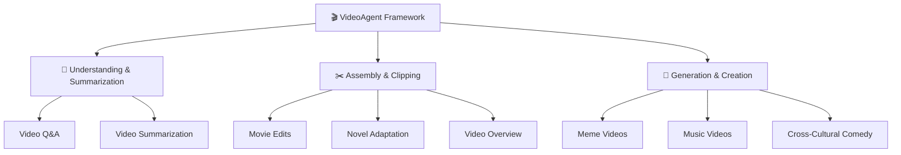
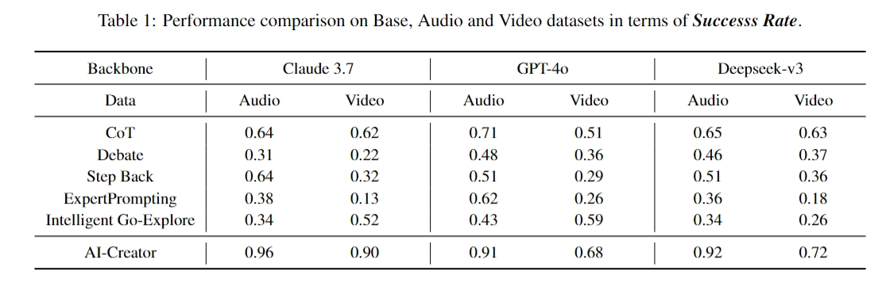

<div align="center">


<!-- # Open Agentic Video Intelligence -->
<br>

**🌟 全面视频智能：理解、编辑和重塑的一体化框架**

<div align="center">
  
</div>

<a href='https://space.bilibili.com/3546868449544308'></a>&nbsp;
<a href='https://www.youtube.com/@AI-Creator-is-here'></a>&nbsp;


</div>


<div align="center">

[English](readme.md) | [简体中文](readme_zh.md)

</div>

---

## 🚀 主要功能


🧠 - **理解视频内容**<br>
通过先进的多模态智能功能，对视频媒体进行深入分析、摘要提取和洞察挖掘。

✂️ - **编辑视频片段**<br>
提供直观的工具，用于组装、剪辑和重新配置内容，并无缝集成工作流。

🎨 - **重塑创意视频**<br>
利用生成技术，通过 AI 驱动的创意辅助功能，制作全新的、富有想象力的视频内容。

🔧 - **多模态代理框架**<br>
通过集成多模态 AI 的框架，提供全面的视频智能，提升性能。

🚀 - **自然语言无缝体验**<br>
通过纯对话式 AI 改变视频交互和创作方式——无需复杂界面或技术专业知识，只需与 VideoAgent 进行自然对话即可。

---
## 📑 目录

- [🌟 系统概述](#系统概述)
- [🔧 评估](#评估)
- [🚀 快速入门](#快速入门)
- [🔮 示例](#示例)
- [💖 致谢](#致谢)


### 🔥 **为什么选择 VideoAgent？**

| 🧠 **易于使用** | 🚀 **无限创意** | 🎨 **高质量** |
|:---:|:---:|:---:|
| 一键式视频创作 | 任意想法皆可成片 | 人类级别的视频制作 |
| 将您的想法转化为专业视频 | 针对独特创意自动生成工作流程 | 提供符合专业标准的视频 |

---

## 🌟系统概述

我们的系统为自动化视频处理引入了三项关键创新。**意图分析** 捕捉用户指令之外的显性和隐性子意图。**自主工具使用与规划** 采用图驱动的工作流生成和自适应反馈循环，实现代理的自动化编排。**多模态理解** 将原始输入转化为语义对齐的视觉查询，以增强检索能力。

### 🧠 **意图分析**

- 🔍 VideoAgent 智能地 **分解用户指令**，识别 **显性和隐性子意图**，捕捉用户可能未明确表达的细微需求。这种高级解析确保了对用户目标的 **全面理解**，而不仅仅是表面命令。

- 🎯 通过 **意图到代理的映射机制**，系统识别出多代理框架中需要哪些功能。这种方法确保了 **高效的组件激活**，同时避免不必要的计算开销，从而实现 **最佳任务执行**。

### 🔧 **自主工具使用与规划**

- ⚙️ **图驱动框架** 自动将用户意图转化为 **可执行的工作流**。系统动态选择合适的代理并构建最佳执行序列。节点代表工具能力，边定义复杂视频任务的连接。

- 🔄 自适应反馈循环通过 **两步自我评估** 不断优化规划过程。这确保了强大的 **自动化决策** 和无缝执行。系统在整个任务生命周期中 **自我纠正** 并优化性能。

### 🎬 **多模态理解**

- 📋 **分镜代理** 将原始用户输入转化为 **优化的视觉查询**。它首先分析预标注的视频素材库，了解可用资源。这一基础分析确保系统知道哪些内容可用于查询处理。

- 💡 代理然后将用户输入 **分解为细粒度的子查询**，这些查询在视觉和语义上都对齐。这种复杂的分解通过将用户意图与数据库中最相关的视觉内容匹配，从而实现 **增强的视频检索**。

<div align="center">




</div>

---

## 🔧评估
We conduct extensive experiments across multiple dimensions to validate the effectiveness of VideoAgent in addressing key challenges.

<div align="center">
    <br>
</div>

The evaluation employs three metrics using shuffled caption queries to test the model's ability to retrieve corresponding visual content: Recall measures the model's ability to correctly reorder shuffled video clips by comparing retrieved clip midpoints against ground truth positions; Embedding Matching-based score assesses coarse-grained alignment between generated videos and high-level caption summaries; and Intersection over Union quantifies temporal alignment accuracy at the clip level by computing the ratio of temporal overlap to total coverage between retrieved and ground truth intervals, providing both fine-grained boundary accuracy and broader content retrieval performance assessment.

<div align="center">
    <br>
</div>

we investigate the number of reflection rounds of the VideoAgent as the research subject. We conduct hyperparameter experiments on workflow composition across two datasets using three LLM backbones. The results clearly demonstrate that although the initial rounds of iteration yield suboptimal outcomes, the success rate of workflow composition significantly improves with increasing reflection rounds on both datasets, eventually stabilizing around 0.95.
<div align="center">
    <div style="display: flex; justify-content: center; width: 80%; flex-wrap: nowrap;">
        
	
    </div>
</div>

---

## 🚀快速入门


### 📥 **克隆与安装**


```bash
git clone https://github.com/HKUDS/VideoAgent.git
conda create --name videoagent python=3.10
conda activate videoagent
conda install -y -c conda-forge pynini==2.1.5 ffmpeg
pip install -r requirements.txt
```


### 📦 **模型下载**


```bash
# 下载 CosyVoice
cd tools/CosyVoice
huggingface-cli download PillowTa1k/CosyVoice --local-dir pretrained_models
```


```bash
# 下载 fish-speech
cd tools/fish-speech
huggingface-cli download fishaudio/fish-speech-1.5 --local-dir checkpoints/fish-speech-1.5
```


```bash
# 下载 seed-vc
cd tools/seed-vc
huggingface-cli download PillowTa1k/seed-vc --local-dir checkpoints
```


```bash
# 下载 DiffSinger
cd tools/DiffSinger
huggingface-cli download PillowTa1k/DiffSinger --local-dir checkpoints
```


```bash
# 下载 Whisper
cd tools
huggingface-cli download openai/whisper-large-v3-turbo --local-dir whisper-large-v3-turbo
```


```bash
# 确保已安装 git-lfs (https://git-lfs.com )
git lfs install
```


```bash
# 下载 ImageBind
cd tools
mkdir .checkpoints
cd .checkpoints
wget https://dl.fbaipublicfiles.com/imagebind/imagebind_huge.pth
```

**🌟 为了您的方便，我们提供了多个模型；您可以根据项目需要选择性下载相关模型。**


<table>
  <tr>
    <th align="center">Feature Type</th>
    <th align="center">Video Demo</th>
    <th align="center">Required Models</th>
  </tr>
  <tr>
    <td align="center">Cross Talk</td>
    <td align="center">English Stand-up Comedy to Chinese Crosstalk</td>
    <td align="center">CosyVoice, Whisper, ImageBind</td>
  </tr>
  <tr>
    <td align="center">Talk Show</td>
    <td align="center">Chinese Crosstalk to English Stand-up Comedy</td>
    <td align="center">CosyVoice, Whisper, ImageBind</td>
  </tr>
  <tr>
    <td align="center">MAD TTS</td>
    <td align="center">Xiao-Ming-Jian-Mo(小明剑魔) Meme</td>
    <td align="center">fish-speech</td>
  </tr>
  <tr>
    <td align="center">MAD SVC</td>
    <td align="center">AI Music Videos</td>
    <td align="center">DiffSinger, seed-vc, Whisper, ImageBind</td>
  </tr>
  <tr>
    <td align="center">Rhythm</td>
    <td align="center">Spider-Man: Across the Spider-Verse</td>
    <td align="center">Whisper, ImageBind</td>
  </tr>
  <tr>
    <td align="center">Comm</td>
    <td align="center">Novel-to-Screen Adaptation</td>  
    <td align="center">CosyVoice, Whisper, ImageBind</td>
  </tr>
  <tr>
    <td align="center">News</td>
    <td align="center">Tech News: OpenAI's GPT-4o Image Generation Release</td>
    <td align="center">CosyVoice, Whisper, ImageBind</td>
  </tr>
  <tr>
    <td align="center">Video QA/Summarization</td>
    <td align="center">Dune 2 Movie Cast Update Podcast</td>
    <td align="center">Whisper</td>
  </tr>
</table>

</div>


### 🤖 **LLM 配置**

```bash
# VideoAgent\environment\config\config.yml 
llm:

  # Video Remixing/TTS/SVC/Stand-up/CrossTalk
  deepseek_api_key: ""  
  deepseek_base_url: ""  

  # Agentic Graph Router/TTS/SVC/Stand-up/CrossTalk
  claude_api_key: ""  
  claude_base_url: ""

  # Video Editing/Overview/Summarization/QA/Commentary Video
  gpt_api_key: ""  
  gpt_base_url: ""  

  # MLLM for caption and fine-grained video understanding
  gemini_api_key: ""  
  gemini_base_url: ""  
```

### 🎯**使用方法**


```bash
# 完成配置后，运行以下指令：
python main.py
# 控制台将输出：
User Requirement: ...
# 示例需求：
# 1. 我需要创建一个现有视频的改写版本，其中语音内容被修改，但保持原说话者的语音。视频应与原视频视觉相同，但根据我的具体要求更新对话。
# 2. 我有一段脱口秀脚本，想将其制作成专业外观的视频。我需要脚本以良好的喜剧节奏和观众反应进行表演，然后与相关视频片段匹配，制作一个完整的脱口秀特别节目。我已经有一个参考脚本和一些想使用的视频片段。
```

---
## 🔮示例

<table>
<tr>
<td align="center" width="33%">
<a href="https://www.bilibili.com/video/BV1C9Z6Y3ESo/ " target='_blank'></a>
电影剪辑
</td>
<td align="center" width="33%">
<a href="https://www.bilibili.com/video/BV1ucZ6YmEBU/ " target='_blank'></a>
表情包视频
</td>
<td align="center" width="33%">
<a href="https://www.bilibili.com/video/BV1t8ZCYsEeA/ " target='_blank'></a>
音乐视频
</td>
</tr>
<tr>
<td align="center" width="33%">
<a href="https://www.bilibili.com/video/BV1ucZ6YmESg/ " target='_blank'></a>
语言喜剧艺术
</td>
<td align="center" width="33%">
<a href="https://www.bilibili.com/video/BV1TmZ6YLEqV/ " target='_blank'></a>
小说改编视频
</td>
<td align="center" width="33%">
<a href="https://www.bilibili.com/video/BV12mZ6YLEqW/ " target='_blank'></a>
视频概览
</td>
</tr>
</table>


有关更多示例使用细节，请参考： 
👉 [Demos Documentation](demos_documents.md)

您可以在我们的 Bilibili 频道上找到更多有趣的视频： 
👉 [Bilibili Homepage](https://space.bilibili.com/3546868449544308)  
欢迎随时查看更多精彩内容！😊


**注意**：所有视频仅用于研究和演示目的。音频和视觉素材来源于互联网。如果您认为某些内容侵犯了您的知识产权，请联系我们。


---

## 💖**致谢**

我们要向许多使 VideoAgent 成为可能的个人和组织表达最深切的感谢。这一框架建立在巨人的肩膀上，受益于开源社区的集体智慧和全球研究人员的开创性工作。

### 🔧 **开源社区与服务提供商**

- [CosyVoice](https://github.com/FunAudioLLM/CosyVoice )
- [Fish Speech](https://github.com/fishaudio/fish-speech )
- [Seed-VC](https://github.com/Plachtaa/seed-vc )
- [DiffSinger](https://github.com/MoonInTheRiver/DiffSinger )
- [VideoRAG](https://github.com/HKUDS/VideoRAG )
- [ImageBind](https://github.com/facebookresearch/ImageBind )
- [Whisper](https://github.com/openai/whisper )
- [Librosa](https://github.com/librosa/librosa )

### 🎨 **内容创作者与灵感来源**

我们的工作得益于各种平台上内容创作者的创造性贡献。我们感谢：

- 🎬 **内容创作者**：用于测试和演示的原始视频内容的创作者
- 🎭 **喜剧演员**：启发我们跨文化改编的艺术家们
- 🎥 **电影制作人**：出现在我们示例中的电影和电视剧的制作团队

**⚠️ 注意**：我们示例中使用的所有内容仅用于研究目的。我们深切尊重所有内容创作者的知识产权，并欢迎任何关于内容使用的关切或反馈。
